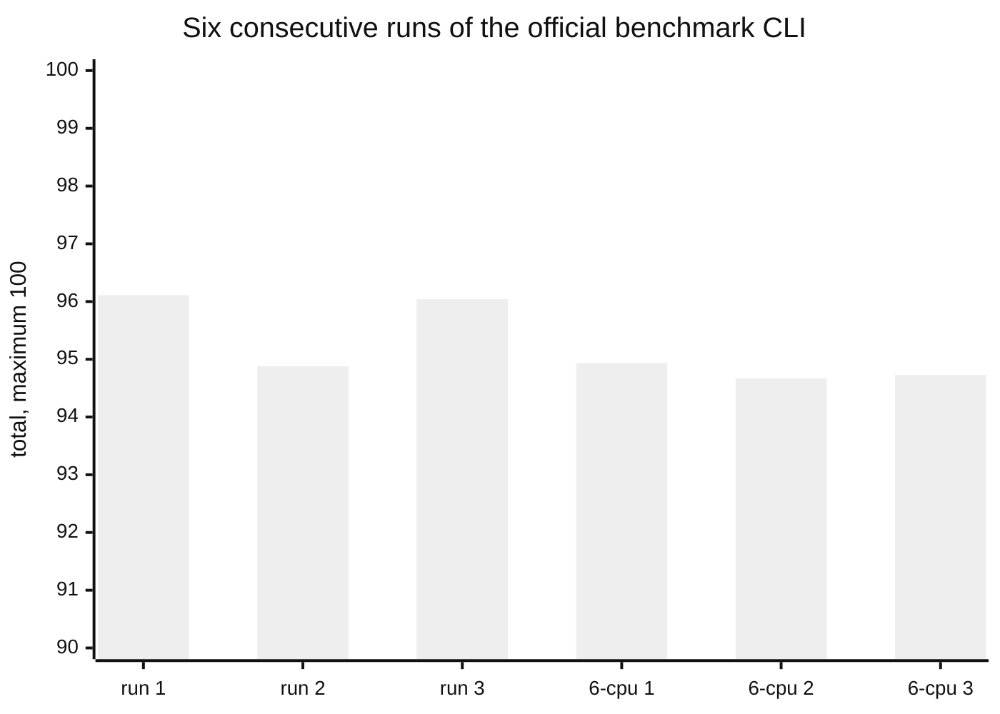
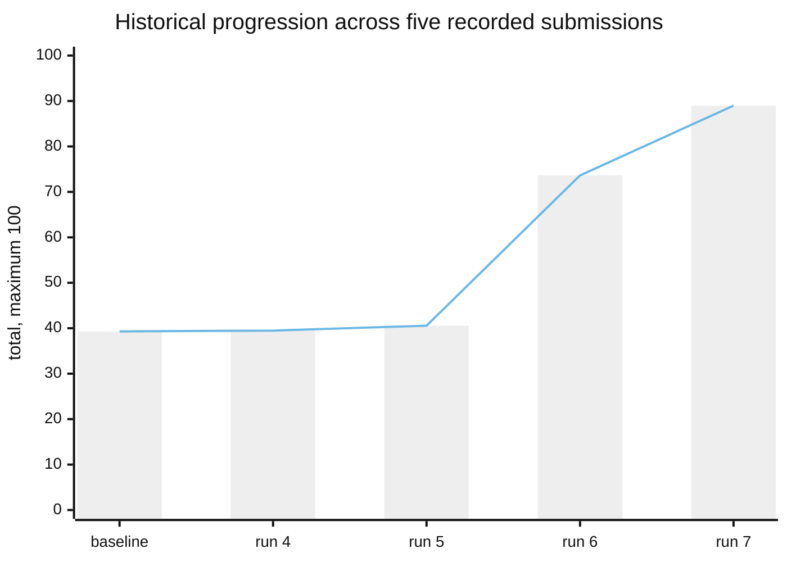
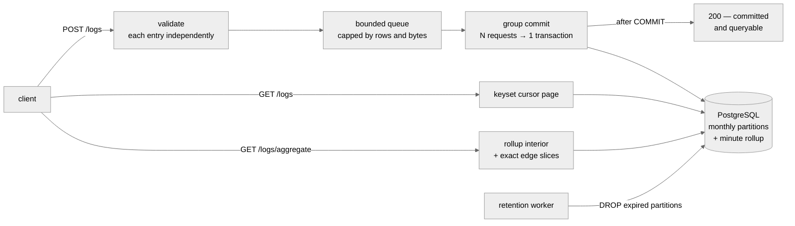
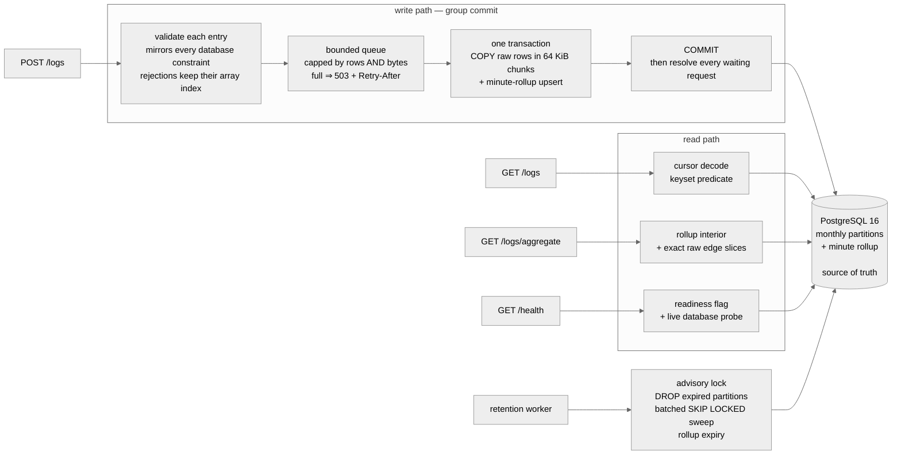

# Optimized Log Ingestion Service

**A log-ingestion service that accepts 15,000 logs/second and answers queries in
single-digit milliseconds — inside half a CPU core and 256 MB of memory.**

---

## The result

**The official benchmark CLI, run locally, is this project's source of truth.**
Six consecutive runs in one session at commit `1b6ee2d` — same seed, same
command, `--full --runner docker`:



| category | run 1 | run 2 | run 3 | mean | spread |
| --- | ---: | ---: | ---: | ---: | ---: |
| **Total** | **96.11** | 94.88 | 96.04 | **95.68** | 1.23 |
| Correctness /15 | 15.00 | 15.00 | 15.00 | **15.00** | **0.00** |
| Performance /50 | 46.47 | 45.80 | 46.49 | 46.25 | 0.69 |
| Queries /15 | 14.64 | 14.08 | 14.55 | 14.42 | 0.56 |
| Reliability /20 | 20.00 | 20.00 | 20.00 | **20.00** | **0.00** |

*The three runs above use the documented `--generator-cpus 4`. A follow-up set at
6 scored 94.93 / 94.67 / 94.73 — raising the flag cost 0.90 and bought nothing.*

**Four things those six runs establish:**

- **Correctness and Reliability were perfect in every run, with zero variance.**
  Not "high" — identical, six times.
- **Ingest is deterministic.** The load scenario returned **14,999 logs/s at
  0.000% errors in all six runs** — the 15,000/s target, hit to within 0.006%.
- **Eventual consistency passed 24 of 24 scenarios.**
- **The service was never the limiting factor.** Every run records
  `serviceLimited: false`. On stress, spike and breakpoint it records
  `generatorLimited: true` — the load generator could not keep up. **Performance
  and Queries are floors, not ceilings.**

<sub>[↑ Where to go next](#where-to-go-next)</sub>

---

## What it is

TypeScript on Bun 1.3.14, Fastify 5 and PostgreSQL 16. Clients post batches of
logs; every entry is validated independently, accepted rows are group-committed,
and a `200` means the rows are committed **and** queryable. Every design choice
in this repository is recorded with the measurement that justifies it and the
test that guards it.

| | |
| --- | --- |
| **Stack** | Bun 1.3.14 · Fastify 5 · PostgreSQL 16 · Docker Compose |
| **Resource envelope** | application **0.5 CPU / 256 MB** · database **1 CPU / 1 GB** |
| **Endpoints** | `POST /logs` · `GET /logs` · `GET /logs/aggregate` · `GET /health` · `GET /metrics` |
| **Ingest throughput** | **14,999 logs/s** at **0.000% errors** — in all six runs |
| **Correctness** | **15 / 15**, zero variance across all six runs |
| **Reliability** | **20 / 20**, zero variance across all six runs |
| **Other gates** | **41 / 41** tests · **73 / 73** reliability probes |
| **Durability** | every acknowledged row survived restart and SIGTERM — 398,600 / 398,600 |
| **Retention** | 30 days by default, reclaimed by dropping monthly partitions |

<sub>[↑ Where to go next](#where-to-go-next)</sub>

---

## How it got there

Before the measurement above, the service was tuned across seven submissions to
a hosted evaluation service that was retired during the project. Those runs are
no longer the result, but they are the record of the improvement — and the
shape of the climb is the interesting part: **three of the four changes were
worth about a point between them.**



**What moved, on the load scenario:**

| metric | before | after | |
| --- | ---: | ---: | ---: |
| accepted throughput | 4,169 /s | **14,999 /s** | 3.6× |
| HTTP error rate | 27.48% | **0.00%** | eliminated |
| request latency p95 | 2,078 ms | **8.18 ms** | 254× |
| aggregate latency p95 | 2,170 ms | **1.00 ms** | 2,170× |
| PostgreSQL CPU, average | 78.21% | **21.50%** | no longer the constraint |

**The two harnesses are not interchangeable, and were never averaged.** They ran
different tester versions on hardware differing by roughly 8×, and their
aggregate probes ask different questions — one issues zero SQL statements where
the other issued one per request. Why that is, and what it cost to learn, is
[docs/RESULTS.md](docs/RESULTS.md) §6.

Full evidence, including the runs that failed and the nine conclusions later
measurements overturned: **[docs/RESULTS.md](docs/RESULTS.md)**.

<sub>[↑ Where to go next](#where-to-go-next)</sub>

---

## How it works



Three properties do most of the work:

- **Group commit.** Concurrent requests are coalesced into one transaction that
  bulk-loads rows with `COPY` and upserts the minute-rollup in the *same*
  transaction — so committed counts can never diverge from committed rows.
- **A `200` means committed and queryable.** A request is answered only after
  its transaction commits. Freshness holds by construction, with no background
  reconciliation.
- **Backpressure, never a false success.** The queue is capped in rows *and*
  bytes; past the cap the service returns `503` + `Retry-After` rather than
  growing memory or acknowledging data it has not written.

<sub>[↑ Where to go next](#where-to-go-next)</sub>

---

## The evidence behind it

This project's method is as much the deliverable as the code. What was actually
done:

| | |
| --- | ---: |
| Individually recorded benchmark runs | **164** |
| Measured submissions | **7** |
| Design decisions recorded with evidence | **19** |
| Narrative measurement write-ups | **14** |
| Reference books reviewed against the requirements | **4** |
| Hypotheses proposed and killed by measurement | **8** |
| Defects deliberately injected to prove the tests can fail | **10** |

Three examples of what that bought:

- **The stack was chosen by a full 2×2**, not a single A/B — Express or Fastify,
  by Node or Bun. The runtime turned out to be the larger effect by an order of
  magnitude, and the two changes are **not additive**. A single comparison could
  not have shown that.
- **Two unused indexes were priced separately, over 30 runs.** Both looked
  identical in the profile — zero scans, maintained on every insert. Measured
  against the query shape each one serves, one could be dropped for free and the
  other made a lookup **42.7× slower**. One was deleted; one was kept.
- **Nine recorded conclusions were later overturned by measurement**, and every
  one is kept in the record with the evidence that killed it.

<sub>[↑ Where to go next](#where-to-go-next)</sub>

---

## Where to go next

| Document | What it answers |
| --- | --- |
| **[docs/RESULTS.md](docs/RESULTS.md)** | What was measured, in what order, and what changed — with the mistakes |
| **[docs/SCHEMA.md](docs/SCHEMA.md)** | How the schema came to be, how it evolved, and what normal form it is in |
| **[docs/DESIGN-DECISIONS.md](docs/DESIGN-DECISIONS.md)** | One entry per choice, with its guard and its evidence |
| **[docs/test_results/](docs/test_results/)** | The raw measurement write-ups, per session |
| [Quick start](#quick-start) · [API](#api) | Run it, and call it |
| [Architecture](#architecture) · [Database design](#database-design) · [Indexes](#indexes) | How it is built |
| [Durability](#durability) · [Known limitations](#known-limitations) | What it guarantees, and what it does not |

> **A note on the sections below.** This README also serves as the full
> reference: API contract, schema, indexes, cursor design, retention and
> durability. The [Performance](#performance) section further down predates the
> current configuration and says so in its own caveat — **[docs/RESULTS.md](docs/RESULTS.md)
> carries the current numbers.**

---

## Quick start

Prerequisites: Docker with the compose plugin. Everything else ships in the
repository.

```bash
docker compose up -d --wait
curl -s http://localhost:8080/health
# → {"status":"ok"}
```

`--wait` blocks until both containers are healthy. Migrations and partition
pre-creation run automatically at startup; `/health` answers `200` only after
they complete.

The four endpoints, end to end:

```bash
# POST /logs — ingest a batch. One entry is invalid ("fatal" is not a level);
# it is rejected by its original index while the valid sibling is accepted.
curl -s http://localhost:8080/logs \
  -H 'content-type: application/json' \
  -d '{
    "logs": [
      {"timestamp":"2026-08-16T09:00:00.123456Z","level":"info","service":"checkout","message":"order placed","attributes":{"trace_id":"abc-123","region":"eu-west"}},
      {"timestamp":"2026-08-16T09:00:00.200000Z","level":"fatal","service":"checkout","message":"invalid level"}
    ]
  }'
# → {"accepted":1,"rejected":[{"index":1,"reason":"invalid level: '\''fatal'\''"}]}

# GET /logs — filter and page (newest first)
curl -s 'http://localhost:8080/logs?service=checkout&level=info&limit=2'
# → {"logs":[{...}],"next_cursor":"eyJ2IjoxLCJ0IjoiMjAyNi0wOC0xNlQwOTowMDowMC4xMjM0NTZaIiwi..."}

# GET /logs/aggregate — bucket counts per hour, grouped by service
curl -s 'http://localhost:8080/logs/aggregate?since=2026-08-16T00:00:00Z&until=2026-08-16T12:00:00Z&bucket=1h&group_by=service'
# → {"buckets":[{"start":"2026-08-16T09:00:00.000000Z","group":"checkout","count":1}]}
```

The host port mapping is `"${HOST_PORT:-8080}:8080"`, so if port 8080 is
already taken on your machine, `HOST_PORT=8081 docker compose up -d --wait`
and point every curl at `http://localhost:8081`.

Stop with `docker compose down`; add `-v` to also discard the database volume.
Note that migrations are checksummed — editing a file under
`src/db/migrations/` against an existing volume fails startup with
`applied migration 001_init.sql was modified`; reset with
`docker compose down -v`.

<sub>[↑ Where to go next](#where-to-go-next)</sub>

---

## Configuration

**Zero-config:** `docker compose up` with no `.env` and no arguments starts the
complete, plain core service — all four endpoints, unauthenticated, defaults
applied. `.env.example` documents every knob; nothing in it is required to
run anything. All integer values are parsed strictly: `0` or garbage is a
startup error, never silently replaced by a default.

| Variable | Default | What it controls |
| --- | --- | --- |
| `PORT` | `8080` | HTTP listen port inside the container |
| `DATABASE_URL` | compose-provided (points at the `postgres` service; credentials are defined in `docker-compose.yml`) | PostgreSQL connection string. The code's own fallback targets `localhost:5432` for running outside compose |
| `BODY_LIMIT` | `4mb` | Maximum accepted request body; larger bodies get `413` |
| `SYNC_COMMIT` | `off` | Durability profile: `off` = commit without waiting for a WAL flush (see [Durability](#durability)); `on` = strictly crash-durable acknowledgement |
| `RETENTION_DAYS` | `30` | How long logs are kept |
| `MAX_LOG_AGE_DAYS` | `0` (off) | Reject logs older than this at ingest. Off by default: refusing a backfill is a change to the ingest contract, so it is opt-in rather than implied by `RETENTION_DAYS` |
| `RETENTION_INTERVAL_MS` | `3600000` | Cadence of retention passes (1 hour) |
| `RETENTION_BATCH_ROWS` | `5000` | Rows per boundary-sweep `DELETE` batch |
| `BATCH_DELAY_MS` | `5` | How long an idle writer waits to gather companions for a lone request. Rows arriving while a flush runs never wait on this — they leave in the next flush, which always takes the whole queue |
| `QUEUE_MAX_ROWS` | `50000` | Backpressure cap on queued rows — exceeding it returns `503` + `Retry-After` |
| `QUEUE_MAX_BYTES` | `33554432` | Backpressure cap on queued bytes (32 MiB) |
| `WRITE_POOL_SIZE` | `2` | Connections reserved for the ingest transactions |
| `QUERY_POOL_SIZE` | `8` in code, **`2` in compose** | Connections for read traffic. Sized to the database, not to the application — eight concurrent unindexed reads all failed at 5.05 s, so a wider pool converts queueing into failures |
| `DB_CONNECT_TIMEOUT_MS` | `2000` | Connection acquisition timeout |
| `QUERY_STATEMENT_TIMEOUT_MS` | `10000` in code, **`8000` in compose** | Server-side `statement_timeout` on the query pool, so an abandoned HTTP request cannot pin a backend forever. Attribute filters are index-backed, so this is a backstop for the remaining scan-shaped query, `q` |
| `HOT_ATTRIBUTE_KEYS` | `trace_id` in code, `` (empty) in compose | Comma-separated attribute keys that get a dedicated partial, ordered index (see [Indexes](#indexes)). Empty string ships no attribute indexes at all |
| `CURSOR_SECRET` | random per process start if unset | HMAC key that signs pagination cursors. Compose pins a development value so cursors stay valid across container restarts; unset, cursors minted before a restart are rejected |
| `SHUTDOWN_TIMEOUT_MS` | `15000` | Graceful-shutdown budget: drain in-flight batches, then exit |

Compose-only variables (not read by the application):

| Variable | Default | What it controls |
| --- | --- | --- |
| `HOST_PORT` | `8080` | Host-side published port (`"${HOST_PORT:-8080}:8080"`) |
| `NODE_OPTIONS` | `--max-old-space-size=192` | V8 heap cap, sized under the 256 MB cgroup limit with room for native buffers and sockets |

<sub>[↑ Where to go next](#where-to-go-next)</sub>

---

## API

All responses are JSON. Every error response uses the shape
`{"error": "<description>"}` — with one documented exception: `POST /logs`
answers partial or full rejection with the `accepted`/`rejected` shape.

| Status | Meaning |
| --- | --- |
| `200` | Success. For `POST /logs`: every accepted entry is committed and queryable |
| `400` | Invalid request — bad filters, bad cursor, invalid body shape, or an all-invalid batch |
| `413` | Body exceeds `BODY_LIMIT` |
| `503` | Server-side unavailability: ingestion queue full, service shutting down, or database unreachable/saturated. Always carries `Retry-After` |
| `404` | Unknown route |
| `500` | Internal error — no client input is supposed to reach this path |

### `GET /health`

```bash
curl -s http://localhost:8080/health
# → {"status":"ok"}
```

`200` only after migrations have run, the database has answered a readiness
probe, and the server is listening. Before that it answers
`503 {"status":"starting"}` — never `200` on an unready service. Every call
also probes the database live, so an unreachable database reads as
`503 {"status":"unavailable"}` rather than a false `200`.

### `POST /logs`

Request body:

```json
{
  "logs": [
    {
      "timestamp": "2026-08-16T09:00:00.123456Z",
      "level": "info",
      "service": "checkout",
      "message": "order placed",
      "attributes": { "trace_id": "abc-123", "region": "eu-west", "attempt": 1 }
    }
  ]
}
```

Per-entry validation (mirrors every database constraint, so the database is
never asked to be the validator):

- `timestamp` — required, ISO 8601 **with an explicit offset**, and not more
  than five minutes in the future. It is normalised exactly once and that same
  value is used for the row, the rollup bucket, and the cursor.
- `level` — one of `debug`, `info`, `warn`, `error`.
- `service`, `message` — non-empty strings.
- `attributes` — optional, **flat** object; values must be strings, finite
  numbers, or booleans. Nested objects and arrays are rejected.
- NUL characters (`\u0000`) are rejected in every string field — JSON permits
  them, PostgreSQL `text` cannot store them.

Response: `200` with

```json
{ "accepted": 5, "rejected": [{ "index": 3, "reason": "invalid level: 'fatal'" }] }
```

An invalid entry never rejects a valid sibling. If **all** entries are invalid,
the response is `400` with `accepted: 0` and the full `rejected` list. The
`200` is sent only after the group-commit transaction has committed, so
accepted rows are queryable the moment the response arrives (subject to the
durability profile — see [Durability](#durability)). Other statuses: `400` for
a body that is not an object with a `logs` array or for malformed JSON, `413`
over `BODY_LIMIT`, `503` + `Retry-After` when the queue is full, the service is
shutting down, or the database is unavailable.

### `GET /logs`

```
GET /logs?service=&level=&since=&until=&q=&attr.<key>=&limit=&cursor=
```

| Parameter | Rules |
| --- | --- |
| `service` | Exact match on the service name |
| `level` | One of `debug`, `info`, `warn`, `error` |
| `since`, `until` | ISO 8601; `until` must not be earlier than `since`. `since` is inclusive, `until` exclusive |
| `q` | Literal, case-insensitive substring match on `message` (implemented with `strpos`, so `%`, `_`, `\` have no wildcard meaning) |
| `attr.<key>` | Equality on the attribute's text value (`attributes ->> key = $n`); may be repeated for several keys. The key is a bound value, never interpolated |
| `limit` | Integer, `1..1000`, default `100` |
| `cursor` | Opaque signed cursor from a previous page — see [Cursor pagination](#cursor-pagination) |

All filters combine freely, in any order. Response:

```json
{
  "logs": [
    {
      "id": "599635",
      "timestamp": "2026-08-16T09:00:00.123456Z",
      "level": "info",
      "service": "checkout",
      "message": "order placed",
      "attributes": { "trace_id": "abc-123", "region": "eu-west", "attempt": 1 }
    }
  ],
  "next_cursor": "eyJ2IjoxLCJ0IjoiMjAyNi0wOC0xNlQwOTowMDowMC4xMjM0NTZaIiwiaSI6IjU5OTYzNSIsImYiOiI..."
}
```

`id` is rendered as a JSON string (a `BIGINT` exceeds JavaScript's safe integer
range) and `timestamp` in UTC with microsecond precision — exactly what
PostgreSQL rendered. Rows are strictly ordered by `timestamp DESC, id DESC`.
Invalid parameters, tampered cursors, and cursors replayed under a different
filter set all return `400 {"error":"..."}`. A database outage returns `503`
+ `Retry-After: 1`.

### `GET /logs/aggregate`

```
GET /logs/aggregate?since=&until=&bucket=&group_by=&service=&level=&q=&attr.<key>=
```

`since`, `until`, and `bucket` (`1m`, `5m`, `1h`, or `1d`) are required;
`group_by` (`service` or `level`) is optional; `service` and `level` narrow the
range. Response:

```json
{
  "buckets": [
    { "start": "2026-08-16T09:00:00.000000Z", "group": "checkout", "count": 42 },
    { "start": "2026-08-16T10:00:00.000000Z", "group": "checkout", "count": 7 }
  ]
}
```

Buckets are ordered by start ascending; empty buckets are omitted; `group` is
`null` when `group_by` is absent. Counts are summed as `BIGINT` in SQL and
checked against the JSON safe-integer range before conversion. See
[Architecture](#architecture) for how the rollup table and raw slices answer
the query.

### `GET /metrics`

An additional operational endpoint beyond the four spec endpoints. Returns the
batcher's counters — `queuedRows`, `queuedBytes`, `inFlightRows`, `flushes`,
`committedRows`, `failedFlushes` — as
`{"ingestion": {...}}`. The measurement scripts use it as a sanity check; it
is not part of the API contract.

<sub>[↑ Where to go next](#where-to-go-next)</sub>

---

## Architecture



### Module layering is strict

No SQL in a handler; no `Request` object below the handler.

| layer | responsibility | where it lives |
| --- | --- | --- |
| **HTTP handler** | routing only | `src/app.ts` |
| **Parsing & validation** | reject at the edge, per entry | `src/ingest/validation.ts` · `src/query/parser.ts` |
| **Service** | batching, query orchestration | `src/ingest/batcher.ts` · `src/query/repository.ts` |
| **Repository** | **the only place SQL is written** | `src/ingest/repository.ts` · the query builders |
| **Configuration** | read exactly once, strictly typed | `src/config.ts` |

### Why group commit

One transaction per HTTP request means one round trip and one WAL sync per
request, and under concurrency those requests contend on the same tables.
Coalescing queued requests into a single transaction changes four things:

| | one transaction per request | **group commit** |
| --- | --- | --- |
| database round trips | one per request | **one per batch** |
| WAL syncs | one per request | **one per batch** |
| rollup consistency | a separate write that can diverge | **same transaction — counts can never diverge from rows** |
| what a `200` means | accepted | **committed and queryable** |

Because a request is answered only after its transaction commits, "accepted" and
"persisted and queryable" are the same event. **Freshness holds by construction,
with no background reconciliation.**

### How large is a batch?

**However large the backlog is.** A flush takes the *entire* queue rather than a
configured number of rows, because its cost — connection checkout, `BEGIN`,
`SET LOCAL`, the rollup upsert, `COMMIT` — is **fixed per transaction, not per
row**.

Capping a batch below what is already waiting pays that fixed cost again for no
reason, and leaves the remainder waiting for another round trip. That is exactly
how a queue turns a throughput shortfall into a latency collapse.

What bounds a single transaction is `QUEUE_MAX_ROWS` and `QUEUE_MAX_BYTES`, and
they are enforced **at admission** — so backpressure surfaces as `503` +
`Retry-After` rather than unbounded memory.

> **What a `200` means:** every accepted entry in the request is committed and
> immediately queryable. How crash-durable "committed" is depends on the
> durability profile — see [Durability](#durability).

### Three connection pools keep roles apart

Each pool has its own `application_name` and its own statement timeout, so reads
can never exhaust the connections writes need.

| pool | shipped size | serves | why that size |
| --- | ---: | --- | --- |
| **write** | **2** | ingest transactions | two concurrent `COPY` streams against a 1-CPU database; more writers contend rather than add capacity |
| **query** | **2** | `GET /logs`, `GET /logs/aggregate` | **sized to the database, not to the application** — see below |
| **maintenance** | **1** | migrations, retention | long-running work never queues behind user traffic |

**Why the query pool is 2 and not wider.** Measured 2026-08-19: eight concurrent
unindexed reads returned **all eight as HTTP 500 at 5.05 s**, cancelled by the
statement timeout. A read pool wider than the database can actually serve does
not buy throughput — **it converts queueing into failures.** Under load,
PostgreSQL ran at 75.6% average of its 1.0 CPU cap while the application sat at
5.4% of its own, so the pool is sized to the constrained resource.

The read `statement_timeout` ships at **8 s** — deliberately not the 10 s code
default. It is a backstop that bounds a `q` substring scan, and the two settings
ship together: the narrow pool is what caps a slow scan at two backends, which
is what made raising the timeout safe. Both are recorded with their measurements
in [design decisions 15, 17 and 19](docs/DESIGN-DECISIONS.md).

> The code *defaults* differ (`QUERY_POOL_SIZE` 8, `QUERY_STATEMENT_TIMEOUT_MS`
> 10000). `docker-compose.yml` is what ships, and it overrides both.

<sub>[↑ Where to go next](#where-to-go-next)</sub>

---

## Database design

```sql
CREATE TABLE logs (
  timestamp  TIMESTAMPTZ NOT NULL,
  id         BIGINT GENERATED ALWAYS AS IDENTITY,
  level      TEXT NOT NULL CHECK (level IN ('debug','info','warn','error')),
  service    TEXT NOT NULL CHECK (length(service) > 0),
  message    TEXT NOT NULL CHECK (length(message) > 0),
  attributes JSONB NOT NULL DEFAULT '{}'::jsonb
             CHECK (jsonb_typeof(attributes) = 'object'),
  PRIMARY KEY (timestamp, id)
) PARTITION BY RANGE (timestamp);
```

**Why `BIGINT` identity, not UUID.** Monotonic keys give B-tree insertion
locality: new rows land at the right edge of the index, pages stay dense, and
write amplification stays low. Random UUID keys fragment pages and inflate
write amplification across every index. The id is rendered as a JSON *string*
in responses so no precision is lost in JavaScript.

**Why `(timestamp, id)` is the primary key.** It *is* the pagination index. A
backward scan over it serves `ORDER BY timestamp DESC, id DESC` with no sort
node — which is what makes the keyset walk cheap — and the `id` tiebreaker
gives deterministic ordering when many rows share a timestamp, which the
specification requires.

**Why range partitioning, monthly.** Retention becomes a partition `DROP`
instead of a mass `DELETE`: no table bloat, no long locks, no vacuum storm.
Monthly granularity keeps the partition count low, so an unfiltered descending
page merge-append scans a handful of children rather than dozens. At startup
the full retention window plus a forward margin is pre-created, ahead of
traffic and never from a concurrent insert path; a `DEFAULT` partition exists
only as a safety net and is treated as a defect when non-empty (it escapes
pruning and retention, so retention sweeps it too).

**Attribute storage strategy and its trade-offs.** Attributes are stored as
`JSONB`, values kept in their original type — a response returns `3` and
`true`, not `"3"` and `"true"`. `attr.<key>` equality is a documented **text**
comparison (`attributes ->> key = $n`), which is correct and parameterised
without any general attribute index. The trade-offs are explicit: attributes
must be flat (no nesting), JSONB costs storage overhead on top of the raw
values, and only the configured hot keys (see [Indexes](#indexes)) get index
support — filtering on an arbitrary key is a scan, not an indexed lookup. That
is a deliberate budget decision, not an oversight.

**Rollup.** A minute-granularity table answers aggregate queries:

```sql
CREATE TABLE logs_agg_1m (
  bucket_start TIMESTAMPTZ NOT NULL,
  service      TEXT NOT NULL,
  level        TEXT NOT NULL,
  count        BIGINT NOT NULL CHECK (count >= 0),
  PRIMARY KEY (bucket_start, service, level)
);
```

Deltas are aggregated in memory per flushed batch, upserted key-sorted (giving
concurrent transactions a consistent lock order), in the **same transaction**
as the raw rows. Counts are `BIGINT` throughout — a 32-bit cast is an overflow
risk at retention scale. Minute granularity re-buckets cleanly into `5m`, `1h`,
and `1d`. When `since`/`until` are not aligned to a minute boundary, the
rollup interior is combined with **exact raw slices for the partial edge
minutes** — a whole edge minute is never counted into a range that does not
contain it. When `q` or any `attr.<key>` filter is present, the raw table
answers, because those dimensions do not exist in the rollup.

<sub>[↑ Where to go next](#where-to-go-next)</sub>

---

## Indexes

Every shipped index exists to serve a named access pattern; the ingestion cost
of each is accepted deliberately.

### Primary key `(timestamp, id)`

Serves: the cursor page — a backward scan returns `ORDER BY timestamp DESC,
id DESC` with **no sort node**, and the `id` tiebreaker makes tied-timestamp
ordering deterministic. `EXPLAIN (ANALYZE, BUFFERS)` on the 1,000-row page
shows a `Limit` over a `Merge Append` of backward index scans across
partitions, 34 shared-buffer hits, no sort — 1.6 ms of PostgreSQL-side
execution.

Ingestion cost: one B-tree insert per row per partition. Because the id is a
monotonic identity, inserts append to the right edge of the index.

### `logs_service_level_page_idx` — removed 2026-08-18, and why

This index — `(service, level, timestamp DESC, id DESC)` — was declared in
migration `001` to make `service`/`level` filters free, and dropped in
migration `004` after being measured. It is documented here rather than
deleted because the reasoning is the useful part.

It cost a second B-tree update per ingested row, and it was not being used:
the profile in `docs/test_results/postgres-profile.md` recorded **zero scans**
against 116 MB, with `EXPLAIN` showing the page query served by backward
primary-key scans instead.

The question that decided it was **not** the write saving but the read cost.
Measured against the query shape the index exists for — a service-filtered
cursor walk — dropping it changed nothing: 12.6–13.1 pages/s before against
12.4–14.4 after, page p50 26.6–34.7 ms against 21.7–30.4 ms, every band
overlapping. At a 96.2% buffer hit ratio, a backward primary-key scan that
discards three rows in four is cheaper than maintaining a fourth B-tree.

Removing it bought −18% WAL per row and +12.4% / +25.1% ingest throughput at
batch 33 / 200. Full evidence: `docs/test_results/index-removal.md`.

**This is workload-specific, not a general rule.** It rests on the read set
being RAM-resident, which is what makes the discarded rows cheap. A deployment
that pages heavily by service over a table much larger than memory should
re-measure before inheriting the conclusion — and the contrasting result from
the same session is the attribute GIN, which was kept because dropping it made
a selective attribute lookup 42.7× slower.

### `logs_attr_<key>_page_idx` — hot attribute, partial

```
CREATE INDEX logs_attr_trace_id_page_idx
  ON logs ((attributes ->> 'trace_id'), timestamp DESC, id DESC)
  WHERE attributes ? 'trace_id';
```

Serves: correlation-ID style lookups (`attr.trace_id=…`) that must also come
back in cursor order — one equality probe, one index scan, no sort.

Why partial and configurable: the index is created at startup from
`HOT_ATTRIBUTE_KEYS` rather than in the SQL migration, because *which*
attribute deserves an index is a deployment decision, not a schema constant.
The `WHERE attributes ? key` predicate means rows without the key are not
indexed at all, so the write cost scales with how often the key actually
appears, not with total ingest volume. That cost is still real — a JSONB
extraction and a scattered B-tree write for every row carrying the key — so
compose ships `HOT_ATTRIBUTE_KEYS=` empty and adds no attribute index by
default; turn one on where the read path actually filters on that key. The
planner only
considers this index when the configured key is emitted as a literal — which
is safe because config validation restricts keys to the identifier character
set; the compared *value* is always a bound parameter.

### `logs_attributes_gin_idx` — `gin (attributes jsonb_path_ops)`, `fastupdate = off`

Serves: an equality filter on *any* attribute key, without that key having to
be configured in advance.

Why it exists: without it, `attr.k=v` had no index to use and fell back to
walking the table in cursor order. That is bounded only by the table size, and
it is paid on a **hit** as much as a miss — a selective filter with a small
limit finds its row immediately and then keeps scanning to decide whether a
next page exists. Measured at 671k rows, one such lookup read every row in
158 ms; with the index it is 0.4 ms.

How the query reaches it: `jsonb_path_ops` answers containment only, so
`buildPredicates` narrows with a containment disjunction and then rechecks the
exact `->>` equality. Both halves are load-bearing — containment is *broader*
than `->>` for numbers, because jsonb compares numerics rather than their text
(`@> '{"k":1.0}'` matches a stored `1`, which `->>` renders as `'1'` and must
not match a query for `'1.0'`), and it is *narrower* for whichever JSON type it
names, which is why a filter value that could have been stored as a string, a
number or a boolean gets one containment term per type.

Ingestion cost: about 4.5% of throughput (16,525 vs 17,305 logs/s measured).
`fastupdate = off` is what makes that trade work: left on, new entries queue in
an unsorted pending list that *every* read has to scan end to end, so a
read-after-write client pays for the writes it is racing. On the mixed
workload that cost more than half the achievable throughput — 6.3k logs/s at
83% database CPU with it on, 10.5k at 41% with it off.

### Rollup indexes

`logs_agg_1m`'s primary key `(bucket_start, service, level)` serves the
rollup-range scan, and `logs_agg_service_bucket_idx
(service, bucket_start, level)` serves rollup reads narrowed by service. These
tables grow one row per (minute, service, level) combination — orders of
magnitude smaller than raw, so their write cost is negligible next to the raw
indexes.

### Deliberately not shipped

- ~~**A general GIN index on `attributes`.**~~ **Reversed by measurement.**
  The argument was that it would tax every insert to accelerate filters that
  are rare, leaving arbitrary `attr.<key>` equality as a documented scan. Two
  things were wrong with it. The scan is not rare when any client does
  read-after-write, and it is not cheap on a hit either — the `limit + 1`
  probe keeps scanning past the matched row to decide whether a next page
  exists, so a lookup that returns one row still reads the whole table. And
  the tax was assumed rather than measured: it is about 4.5% of ingest
  throughput, against a 414× improvement on the lookup. It is now shipped as
  `logs_attributes_gin_idx`, with `fastupdate = off`, which is where the real
  cost of a GIN index on this workload turned out to live.
- **`pg_trgm` on `message`.** `q` is a literal, case-insensitive substring
  match (`strpos`) — correct, parameterised, and wildcard-free. A trigram
  index would materially inflate an index footprint already measured at over
  half the table size, to accelerate a filter that is not the hot path.

<sub>[↑ Where to go next](#where-to-go-next)</sub>

---

## Cursor pagination

- **Keyset, not offset.** The page query is
  `WHERE … AND (timestamp, id) < ($t::timestamptz, $id::bigint)
   ORDER BY timestamp DESC, id DESC LIMIT limit + 1`.
  It fetches `limit + 1` rows to decide whether more exist; the cursor is
  anchored to the **last row actually returned**, never the probe row.
- **The cursor carries the exact database-rendered timestamp.** PostgreSQL
  stores microseconds; JavaScript `Date` keeps milliseconds. Round-tripping the
  key through `Date` would truncate it and silently skip every row sharing
  that millisecond — short pages, early end, clean-looking `null`. So the
  cursor payload carries the timestamp exactly as `to_char(…, 'US')` rendered
  it, as text, and the next predicate feeds it straight back. It never passes
  through a JavaScript `Date`.
- **Opaque and signed.** The payload (version, timestamp, id, filter hash) is
  base64url-encoded and HMAC-SHA256-signed with `CURSOR_SECRET`. Decoding is
  strict — malformed, tampered, or wrongly-signed cursors are `400`.
- **Filter binding.** The payload also carries a hash of the canonical active
  filter set, so a cursor minted under one filter combination cannot be
  replayed against another: `400 {"error":"cursor does not match the active
  filters"}`.
- **`next_cursor` is `null` only at the true end** of the filtered result set:
  when the `limit + 1` probe found no extra row. A walk that ends with a
  non-null cursor and a subsequent request that returns `next_cursor: null`
  has genuinely seen every matching row — this is what the drain harness
  cross-checks against `COUNT(*)`.

<sub>[↑ Where to go next](#where-to-go-next)</sub>

---

## Retention

- **Configuration:** `RETENTION_DAYS` (default `30`) defines the cutoff;
  `RETENTION_INTERVAL_MS` (default one hour) the pass cadence. The first pass
  runs about a second after startup.
- **Expiry detection.** A row or partition is expired when its entire range is
  older than `now() − RETENTION_DAYS`.
- **Partition drop.** A monthly partition is dropped with a plain
  `DROP TABLE` — metadata-only, no bloat, no long lock — and only when the
  whole month has expired. Partitions are pre-created ahead of traffic so
  drops never race with inserts.
- **Boundary sweep.** Rows older than the cutoff that do not fill an entire
  partition (including any stray rows in the `DEFAULT` partition) are deleted
  in small ordered batches of `RETENTION_BATCH_ROWS` (default 5000) with
  `FOR UPDATE SKIP LOCKED`, bounded to 20 batches per pass — short
  transactions, no long locks, and progress resumes on the next pass.
- **Rollup expiry.** The same policy applies to `logs_agg_1m`: expired buckets
  are deleted, and the boundary minute is recomputed from the remaining raw
  rows, so a dropped partition never leaves stale counts queryable.
- **Safety.** One advisory-locked worker on the maintenance pool — at most one
  instance retains, it never shares connections with user traffic, and if it
  cannot acquire its lock or reach the database at startup the service still
  serves traffic (the failure is logged, not fatal).

<sub>[↑ Where to go next](#where-to-go-next)</sub>

---

## Durability

Stated plainly, with no overclaim.

- **Default (`SYNC_COMMIT=off`):** the ingest transaction commits without
  waiting for a WAL flush to durable storage. A `200` **still means the rows
  are committed and queryable** — every query will see them. But if the
  PostgreSQL host dies uncleanly (power loss, kernel panic), the last window
  of acknowledged writes can be lost. This is the standard PostgreSQL
  asynchronous-commit trade-off, chosen as the default because the service's
  stated goal is throughput under a 0.5 CPU / 256 MB budget.
- **Strict (`SYNC_COMMIT=on`):** the ingest transaction sets
  `synchronous_commit = on` locally, so the commit waits for the WAL flush and
  a `200` is crash-durable acknowledgement — at the cost of ingest latency
  under load.

Switch profiles by setting `SYNC_COMMIT=on` in the compose environment (or the
deployment environment variable). The value is applied per ingest transaction
(`SET LOCAL`), so the profile can be chosen at startup without touching the
database configuration.

<sub>[↑ Where to go next](#where-to-go-next)</sub>

---

## Performance

> **These Phase 5 figures predate the current write and attribute-query
> configuration.** Since they were captured, the flush policy changed from a
> 2,000-row cap to a full-queue drain, `wal_compression` was dropped, the
> `trace_id` hot-attribute index was removed from the shipped compose, and a
> `jsonb_path_ops` GIN index on `attributes` was added. They are retained as an
> accurate record of the configuration they measured; they are no longer a
> description of what ships. The [reconfiguration results](#reconfiguration-results)
> below carry the current numbers, and are held to a lower evidentiary standard —
> read both sections' caveats before quoting either.

**The figures below are transcribed from `bench/results/final.md`
(Phase 5).** The shipped scripts emit the same kinds of metrics, but the exact
ingestion and drain console summaries behind this table were not retained in
`bench/raw/`. The retained raw files support the storage and buffer fields; the
resource CSV combines multiple capture attempts and is not a clean sampling
window. Current measurements, taken to the standard described there, are in
[docs/RESULTS.md](docs/RESULTS.md). The
measurement ran on the accumulated database (3,001,180 rows at walk time) —
larger than any clean re-ingestion would produce, so the recorded read-path
case is harder than a smaller clean dataset.

**Environment.** The capped compose stack: application 0.5 CPU / 256 MB,
PostgreSQL 1 CPU / 1 GB (`docker-compose.yml`), running under Docker on a
Windows 11 host with the load generator on the host. Port 8080 was occupied on
the development machine, so every measurement used `HOST_PORT=8081`; the
shipped default remains 8080.

**Dataset.** Generated by `scripts/benchmark.mjs` — 3,001,180 rows at walk
time.

**Batch / page sizes.** Ingestion at batch size 200; the drain walks
1,000-row pages.

**Methodology.** Ingestion: fixed 30-second window, 64 concurrent workers,
with a concurrent aggregate probe every second. Drain:
`scripts/drain.mjs` walks `GET /logs` sequentially by cursor to the true end
and reports pages/s, rows/s and per-page percentiles — and it **fails the run**
on duplicates, ordering violations, or a unique-row count that does not match
`EXPECT_TOTAL`. Page-query cost:
`EXPLAIN (ANALYZE, BUFFERS)` against the live database (`docs/explain/`).
Resources: `scripts/capture-resources.mjs` samples both containers concurrently
during the load window and records the actual elapsed time and sample count.
Every raw-output path is create-only, so repeating a run name fails instead of
silently concatenating or overwriting evidence.

**Reproduce:**

```bash
HOST_PORT=8081 docker compose up -d --build --wait

RUN_NAME=recapture-20260816 DURATION_SECONDS=35 npm run bench:capture &
CAPTURE_PID=$!
BASE_URL=http://127.0.0.1:8081 DURATION_SECONDS=30 CONCURRENCY=64 BATCH_SIZE=200 RESULT_PATH=bench/raw/recapture-20260816-ingest.json npm run bench
wait "$CAPTURE_PID"
COUNT=$(docker compose exec -T postgres psql -U logger -d logs -tAc "SELECT count(*) FROM logs;" | tr -d '[:space:]')
BASE_URL=http://127.0.0.1:8081 PAGE_SIZE=1000 EXPECT_TOTAL=$COUNT DEADLINE_SECONDS=30 RESULT_PATH=bench/raw/recapture-20260816-drain.json npm run bench:drain
```

**Results (final):**

| Measurement | Result |
| --- | --- |
| Ingestion throughput | **21,187 logs/s** sustained over 30 s, 64 workers, batch 200 (requirement ≥ 15,000 — met with ~40% margin) |
| Accepted / errors | 649,600 accepted, **0 errors** |
| Ingest latency p50 / p95 / p99 | 564 / 847 / 915 ms (per whole batch of 200) |
| Aggregate p95, concurrent with ingestion | **101 ms** (requirement < 1 s met; internal double-digit-ms target missed) |
| Drain rate | 86.8 pages/s, 86,761 rows/s at 3,001,180 rows; true end in 34.6 s, so the internal 30 s window was missed |
| Page latency p50 / p95 / p99 | 9.4 / **16.1** / 75.7 ms |
| Walk integrity | 3,002 pages to the true end; unique rows = `COUNT(*)` exactly; 0 duplicates, 0 ordering violations — at 3× the required volume, across two digit-length boundaries |
| PostgreSQL-side page execution | ~1.7 ms (`EXPLAIN (ANALYZE, BUFFERS)`: `Limit` over `Merge Append` of backward index scans, ~34 shared-buffer hits, no sort node) |
| Application CPU / RSS under load | ~41–50% of 0.5 CPU / 41–55 MB of 256 MB — no restart, large headroom |
| PostgreSQL CPU / RSS under load | ~45–49% of 1 CPU / ~327 MB of 1 GB — deliberate read headroom |
| Recorded storage snapshot at 3 M rows | **1,495 MB** total, **514 MB of it indexes** (34%); retained in the legacy summary but not independently reconstructible |
| Buffer hit ratio | 97.3% |

**Internal query-target status — all three were missed:**

- The 3,002-page walk completed in 34.6 seconds. The evaluator-shaped window
  is 30 seconds, which required at least 100.1 pages/s; 86.8 pages/s would cover
  only about 2.604 M rows in that window.
- The plan target of ≤ 8 ms p95 for a 1,000-row page was missed at 16.1 ms.
- Concurrent aggregate p95 was 101 ms, narrowly outside the internal
  double-digit-ms target, while still comfortably meeting the specification's
  <1 s requirement.

PostgreSQL executes the same page in ~1.7 ms, so the remaining page time is
app-side materialisation, JSON serialisation, the HTTP write inside the
0.5-CPU application, plus host→container overhead. The experiment queue
attacked exactly this gap; the record is in `bench/results/experiments.md`.

**Bottlenecks found and optimisations applied:**

1. **Cursor ordering defect (fixed).** An unqualified `ORDER BY id` resolved
   against the `id::text` output alias, sorting lexicographically while the
   keyset predicate compared `id` as `bigint` — rows sharing a timestamp were
   silently skipped mid-walk while the response reported a clean
   `next_cursor`, and the plan lost its pure index scan. The drain harness
   measured **18 ordering violations before, 0 after**; this historical figure
   is recorded in `plan/HANDOFF.md` and has no retained raw capture. Both sort
   columns are now table-qualified, with a comment in the query explaining why
   they must stay that way.
2. **Crash loop on database loss (fixed).** Startup database work ran at
   import time, so an unreachable PostgreSQL rejected the bootstrap and the
   restart policy returned the process to the same failing state. Startup now
   retries with bounded backoff, and a connection-loss classifier maps
   outages to `503` + `Retry-After` on every endpoint instead of killing the
   process — the failure drill asserts the container does not restart.
3. **A database outage returned `500` on some hosts (fixed).** That
   connection-loss classifier matched `ENOTFOUND` but not `EAI_AGAIN`. Which
   code arrives depends on the *resolver*, not on the fault: a container
   runtime whose embedded DNS answers `NXDOMAIN` for a stopped service gives
   `ENOTFOUND`, while one answering `SERVFAIL` gives `EAI_AGAIN` for the
   identical outage. On hosts in the second group, `GET /logs`,
   `GET /logs/aggregate` and `POST /logs` returned `500` with no `Retry-After`
   during an outage, and `withDatabaseRetry` would not retry a resolver blip at
   startup. The whole `getaddrinfo` family is now classified as unavailable.
   The defect survived because the classifier had no unit test at all despite
   being the single decision point behind every `503`; it now has one
   (`test/unit/pools.test.ts`), including the case that a client's own mistake
   — a syntax error, a constraint violation, a fired `statement_timeout` — must
   never be reported as the database being down.
4. **Unaligned aggregate ranges (fixed, then refined).** Aggregate queries
   whose `since`/`until` are not minute-aligned now answer from the rollup
   interior plus exact raw slices for the partial edge minutes, instead of a
   full raw scan; sub-millisecond digits past a minute boundary are handled
   exactly. Whole edge minutes are never counted into a range that does not
   contain them.
5. **PostgreSQL-side JSON (tried, lost, reverted).** Building one jsonb per
   row inside PostgreSQL plus a direct response write made the drain slower
   (57.5 vs 85.0 pages/s) — jsonb construction on the single PostgreSQL CPU
   cost more than the app's serialisation under its own cap. Recorded as a
   measured loss in `bench/results/experiments.md`, not kept.
6. **Open bottleneck (page latency).** 16.1 ms p95 here, 87.3 ms on the Linux
   host, against ~1.7 ms of database-side execution. Now attributable: the
   drain is application-CPU-bound, with the container at ~89% of its cap while
   PostgreSQL idles at 23%. Raising the cap to 2.0 CPU improves page p95 to
   39.0 ms — still 4.9× the 8 ms budget, so the cap is not the whole story.
7. **Open bottleneck (aggregate tail latency).** The rollup plan is fast in its
   standalone EXPLAIN capture, but concurrent end-to-end aggregate p95 is
   101 ms here and 562 ms on the Linux host. It falls to 90 ms when the
   application cap is raised, so the tail is app-side contention rather than
   plan selection.

**Freshness is now measured** — see [Known limitations](#known-limitations) and
[docs/test_results/linux-verification-results.md](docs/test_results/linux-verification-results.md) §6. The
structural argument that a `200` follows commit is confirmed numerically: 3,821
of 3,821 probes found their row on the first attempt, and the measured delay
distribution is indistinguishable from the latency of the query doing the
looking.

### Reconfiguration results

**Evidentiary standard.** These runs used ad-hoc harnesses rather than the
committed `bench/` scripts, and no raw capture was retained under `bench/raw/`.
The load generator ran on the same host as the containers and competed with
them for CPU, so **the deltas are the result; the absolute throughput figures
are soft** and read low against a generator on separate hardware. Treat this
section as a change record, not as a replacement for a Phase 5-grade capture.
Re-running the committed protocol in `plan/05-BENCHMARK-PROTOCOL.md` is
outstanding work.

**What changed.** Four things, in descending order of measured effect: the
batcher now drains its whole queue per flush instead of capping at 2,000 rows;
`attributes` gained a `jsonb_path_ops` GIN index with `fastupdate = off`; the
`trace_id` hot-attribute index was removed from the shipped compose; and
`wal_compression` was dropped.

**Ingestion**, 30 s, 96 workers, batch 50, capped compose stack:

| Measurement | Before | After |
| --- | --- | --- |
| Ingestion throughput | 3,400 logs/s | **13,694 logs/s** (17,305 on a warm database) |
| PostgreSQL CPU, average | ~78% of 1 CPU | **~33%** |
| Application CPU, average | ~10% of 0.5 CPU | **~46%** |
| Errors | 0 | 0 |

> **This table pairs environments and is the weakest evidence on this page.**
> The "before" column was captured on different hardware with a different
> harness from the "after" column; it is not a controlled A/B and the ratio
> between the columns should not be quoted. The mixed-workload table below
> *is* a clean local A/B — both columns came from the same host and harness,
> isolating the attribute-index change. Batch size is also a large confound
> here: measured at batch 200 rather than 50, the same configuration reaches
> 20,720 logs/s. See [Linux verification](#linux-verification) below for
> figures taken under one controlled protocol.

The CPU inversion is the substantive result: PostgreSQL was the constraint and
now has headroom, which is the read-headroom rule (`search_rnd/RND.md` §12.7)
finally holding under ingestion. The application is now the binding constraint
against its own 0.5-CPU cap.

**Mixed workload** — the same ingestion with a read-after-write attribute
lookup issued after *every* accepted `POST`, which is the shape any client that
confirms its own writes produces:

| Measurement | Before | After |
| --- | --- | --- |
| Throughput under 1:1 read-after-write | 2,431 logs/s | **10,062 logs/s** |
| Lookups that found the row | 0.4% | **100%** |
| HTTP error rate | 20% | **0%** |
| PostgreSQL CPU, average | ~98% | **~40%** |

**Attribute lookup**, `EXPLAIN (ANALYZE)` at 671k rows: **158 ms → 0.4 ms**.
The pre-index cost was paid on a *hit* as much as a miss, because the
`limit + 1` page probe keeps scanning past the matched row to decide whether a
next page exists — see [Indexes](#indexes).

**Cost of the GIN index**, isolated: 16,525 vs 17,305 logs/s, about 4.5% of
ingestion throughput. `fastupdate = off` is what keeps that trade favourable;
left at the default, the mixed workload ran at 6.3k logs/s and 83% database CPU
instead of 10.5k at 41%.

**Unchanged by this work.** The page-latency and drain figures above were not
re-measured; nothing here targets the app-side materialisation cost that
dominates them, and the open bottlenecks (5) and (6) stand as recorded.

### Linux verification

The figures above were all taken under Docker Desktop with the WSL2 backend,
which was enough to make several conclusions unsafe. The branch was re-measured
on native Linux (Ubuntu 24.04, 16 CPU, Docker 29.7.2) under the shipped caps.
Full record, including raw-output provenance and evidence limits, is in
[docs/test_results/linux-verification-results.md](docs/test_results/linux-verification-results.md).

**Two hypotheses were put and both were refuted**, which is the main value of
the run:

- *"The application-CPU bottleneck is a WSL2 artifact."* **Wrong.** The
  `/metrics` ceiling reproduces at 934 req/s on native Linux with ordinary port
  NAT, and raising only the application's CPU cap multiplies it 3.6× to 4,463
  req/s. The limit is the container's CPU allowance — roughly 0.4 ms of
  application CPU per trivial request — not the transport.
- *"The batch-size curve will flatten on Linux."* **Wrong.** The shape is
  unchanged, and the batch-50 penalty is slightly worse (0.62× of batch 200,
  against 0.69× under WSL2). Per-request cost belongs to the service.

Held on both platforms: correctness throughout (typecheck, 26/26 tests with the
integration tests actually running, smoke, 73/73 reliability), the graceful
`SIGTERM` drain with every acknowledged row persisted, 100% first-probe
read-after-write visibility, and pagination integrity — a full 3,165,800-row
walk returned exactly the trusted count with 0 duplicates and 0 ordering
violations.

**Found only on Linux:** a database outage returned `500` instead of `503`
because the error classifier listed `ENOTFOUND` but not `EAI_AGAIN`. Fixed, with
the regression tests the classifier had never had — see
[Durability](#durability).

**Measured worse on Linux, on slower hardware:** ingestion 14,320 logs/s
sustained under the 0.5-CPU cap (below the 15,000 requirement), the drain at
32.2 pages/s taking 98.4 s, and page p95 at 87.3 ms. Absolute throughput is not
comparable across the two hosts; the missed targets are recorded as misses
either way.

<sub>[↑ Where to go next](#where-to-go-next)</sub>

---

## Testing and CI

- **Unit tests** (`npm test`) — `test/unit/`: entry validation (including the
  mirror-the-database cases: null characters, future timestamps, attribute
  flatness and value types), the batcher (coalescing, row/byte caps,
  backpressure rejection, shutdown draining), and the query path (parser
  strictness, cursor codec signing/filter-binding, predicate building,
  serialisation).
- **Integration tests** (`npm run test:integration`) — `test/integration/`:
  one test compares aligned, unaligned-edge, grouped, and raw aggregate results
  with direct SQL truth; the other seeds an expired partition, runs one
  retention cycle directly (rather than waiting for the one-hour timer), and
  asserts both raw rows and rollup counts are gone.
- **Contract smoke** (`npm run smoke`) — `scripts/contract-smoke.mjs`, run
  against the live compose stack: health, ingestion with an invalid entry
  rejected by original index while valid siblings are accepted, an
  equal-timestamp cursor walk including a digit-boundary tie regression
  (ids crossing 9→10, which is what exposed the ordering defect), the
  hot-attribute filter, literal `%`/`_` substring matching, aggregate counts,
  a tampered cursor → `400`, an all-invalid batch → `400`, malformed JSON →
  `400`.
- **Reliability matrix** (`npm run reliability`) —
  `scripts/reliability-check.mjs`, 73 checks: bad inputs (limits, timestamps,
  cursors, filter values) must produce `4xx` with the required error shape —
  never a `500`, never a crashed process.
- **Failure drill** (`npm run drill`) — `scripts/failure-drill.sh`: stop
  PostgreSQL, assert every endpoint degrades to `503` + `Retry-After`, assert
  the application container does **not** restart, and assert recovery once the
  database returns; then ingest under load, send repeated `SIGTERM`, require a
  graceful exit, restart the manually stopped container, and require the
  persisted-row delta to equal the client-acknowledged count exactly.
- **Drain harness as a correctness gate** — after any change that could touch
  ordering or cursor logic, run `npm run bench:drain` with `EXPECT_TOTAL` set;
  duplicates, ordering violations, or a mismatched row count fail the run.
- **CI** (`.github/workflows/ci.yml`, runs on every push and PR): on
  `ubuntu-latest` with a PostgreSQL 16.4 service container, installing **both
  runtimes** — `npm ci`, `npm run typecheck`, `npm test` (tsx), `bun test`,
  `docker build`, `docker compose up -d --wait`, `npm run smoke`, then
  `docker compose down -v`. There is no build step: the image runs TypeScript
  directly, so `npm run typecheck` is the only thing between a type error and
  production, and both test runners are exercised because they do not agree on
  everything.

<sub>[↑ Where to go next](#where-to-go-next)</sub>

---

## Known limitations

- **Page latency target not yet met.** ≤ 8 ms p95
  per 1,000-row page is the plan target; measured at 16.1 ms p95. See
  [Performance](#performance).
- **The final full drain missed the internal deadline.** It reached the true
  end with correct ordering and counts, but 3,002 pages took 34.6 seconds. At
  the measured 86.8 pages/s, a 30-second walk reaches only about 2.604 M rows;
  completing 3,001,180 rows required at least 100.1 pages/s.
- **Aggregate p95 missed the internal target.** The recorded 101 ms meets the
  specification's <1 s requirement but is not double-digit milliseconds.
- **The final measurement ran on an accumulated database** (3 M rows) rather
  than a freshly wiped volume; read-path numbers are therefore the harder
  case, not the easier one. The shipped scripts can repeat the methodology,
  but the exact final ingestion and drain outputs were not retained under
  `bench/raw/` for independent reconstruction.
- **Raw benchmark evidence is incomplete.** The retained resource CSV contains
  two headers and samples from multiple attempts; the final ingestion, drain,
  and E1+E2 console summaries are not present in `bench/raw/`. Headline figures
  should be treated as run records until a clean recapture is retained.
- ~~**Freshness is unmeasured.**~~ **Closed.** A harness probing after every
  accepted `POST` against a warm 3.17 M-row database found the row on the
  **first** probe 3,821 times out of 3,821, with delay p50 95 ms, p95 214 ms,
  p99 303 ms, max 537 ms. The delay distribution and the probe's own latency
  agree to within a fraction of a millisecond, which is the measurement
  confirming there is no visibility lag to find: the row is already committed
  when the `POST` is acknowledged, and the "delay" is just the cost of the
  query looking for it. Details in
  [docs/test_results/linux-verification-results.md](docs/test_results/linux-verification-results.md) §6.
- **Unaligned aggregate ranges read raw edge slices.** Correct and exact, but
  a range whose edges fall inside minutes costs two raw slice queries on top
  of the rollup interior; `q`/`attr.*` aggregate queries scan raw rows by
  construction (those dimensions are not in the rollup).
- **`q` is the one remaining scan-shaped filter.** It is a literal `strpos`
  substring match with no trigram support — deliberate (see
  [Indexes](#indexes)). `attr.<key>` equality is no longer in this category:
  the `jsonb_path_ops` GIN index answers any key, and a hot key additionally
  buys sort-free cursor order. The compose `QUERY_STATEMENT_TIMEOUT_MS=8000` is
  the backstop for a `q` scan on a large table.
- **The application container is the binding constraint — confirmed on native
  Linux.** It sits at ~99% of its 0.5-CPU cap on the write path and ~89% on the
  read path, while PostgreSQL keeps 40–75% of its own cap in reserve. Raising
  only the application cap to 2.0 CPU takes ingestion from 13,922 to 25,574
  logs/s and moves saturation onto PostgreSQL, which is the diagnostic that
  settles it. Further throughput has to come from app-side cost, not from the
  database. This inverts the constraint the earlier tuning was written against.
- **15,000 logs/s is not met under the shipped 0.5-CPU application cap.**
  14,320 logs/s sustained over 221 s on the Linux host, 0 errors. The same run
  reaches 25,574 logs/s with the cap at 2.0 CPU, so this is a cap choice rather
  than a defect — but under the caps as shipped, the specification's ingestion
  requirement is missed on that hardware.
- **Index footprint remains material.** The preliminary ~600k-row snapshot was
  110 MB of indexes in 203 MB total; the legacy 3 M-row summary records 514 MB
  of indexes in 1,495 MB total (34%). The old capture script did not traverse
  the partition tree, so neither historical ratio is independently
  reconstructible from the shipped raw evidence. New captures emit exact byte
  counts across every partition. Both historical snapshots predate
  `logs_attributes_gin_idx`; it has since been measured at **131 MB of 477 MB
  of index at 3.17 M rows** (~41 bytes/row, ~13% of total `logs` size) — see
  [docs/test_results/linux-verification-results.md](docs/test_results/linux-verification-results.md) §5.
  The shipped configuration carries **three** indexes per partition, the GIN
  index included.
- **Default durability profile is not crash-durable.** With `SYNC_COMMIT=off`
  (the default), an unclean PostgreSQL host failure can lose a window of
  acknowledged writes; a `200` remains a committed-and-queryable guarantee.
  Switch to `SYNC_COMMIT=on` for strict durability.
- **Cursors do not survive a secret change.** With `CURSOR_SECRET` unset a new
  random secret is generated at every start and previously minted cursors are
  rejected — intended, but it looks like a bug in manual testing. Compose pins
  a development secret.
- **Contract constraints by design.** Entries more than five minutes in the
  future are rejected; attributes must be flat with string/number/boolean
  values; request bodies are capped at `4mb`.
- **Retention cadence is coarse.** Boundary sweeps run hourly (default) and
  are bounded to 20 batches per pass, so a very large backlog of boundary rows
  drains over several passes. Expired whole partitions drop immediately.

<sub>[↑ Where to go next](#where-to-go-next)</sub>

---

## Optional features

Every optional behaviour below is documented with its default state. The
zero-config `docker compose up` remains contract-compatible with all of them
at their defaults.

| Feature | Default | Enable / disable |
| --- | --- | --- |
| Strict durability | **Off** | `SYNC_COMMIT=on` in the compose environment (or the deployment env) makes `200` crash-durable; `SYNC_COMMIT=off` (default) is the throughput profile. Both are contract-compliant |
| Hot attribute indexes | **None** (compose ships `HOT_ATTRIBUTE_KEYS=`) | `HOT_ATTRIBUTE_KEYS=trace_id,request_id` adds a partial ordered index per key; empty disables all attribute indexes and removes them at startup. Keys must match the identifier character set. Each key costs a JSONB extraction and a scattered B-tree write on every ingested row, so index a key only where reads actually filter on it |
| Fixed cursor secret | **Development value in compose** | Compose sets `CURSOR_SECRET` so cursors survive restarts; unset it to mint a random secret per start (cursors invalidated across restarts). A production deployment should set its own |
| Host port mapping | **`8080`** | `HOST_PORT=<port> docker compose up` publishes the service on another host port |

The default configuration — group commit with `synchronous_commit = off`,
30-day retention, no attribute indexes — is the plain core service with all
four endpoints unauthenticated.

<sub>[↑ Where to go next](#where-to-go-next)</sub>
