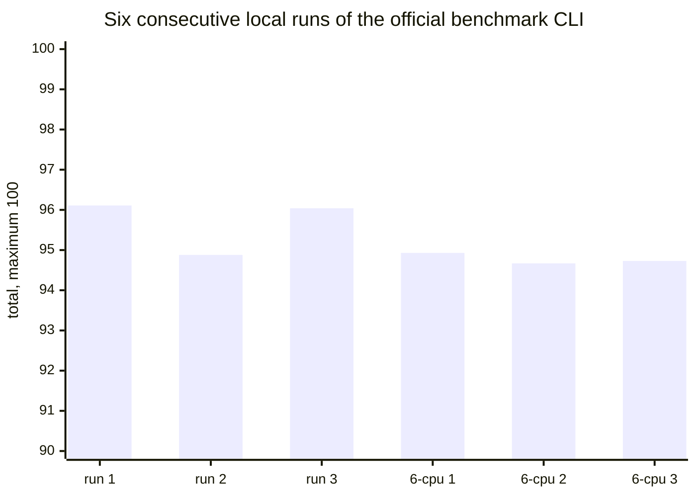
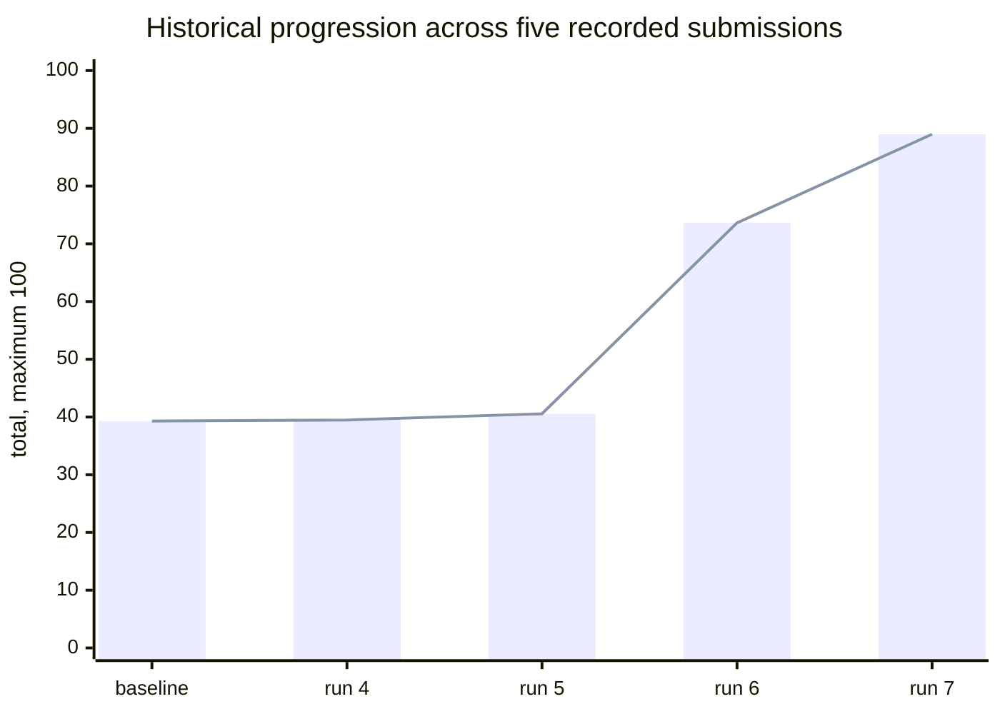
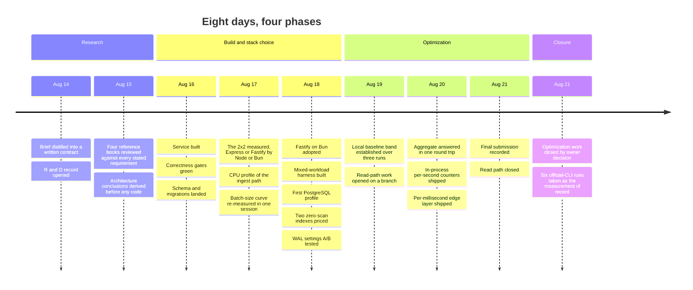
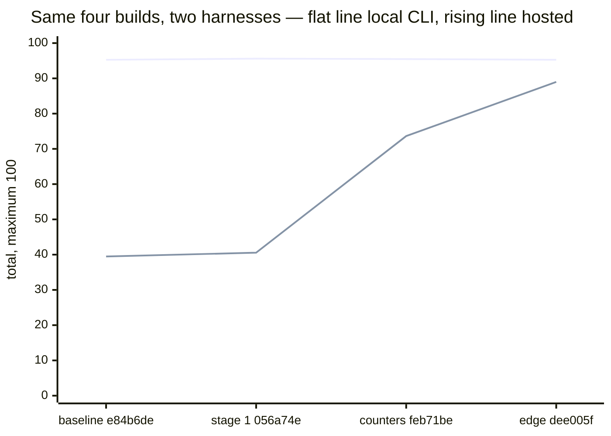
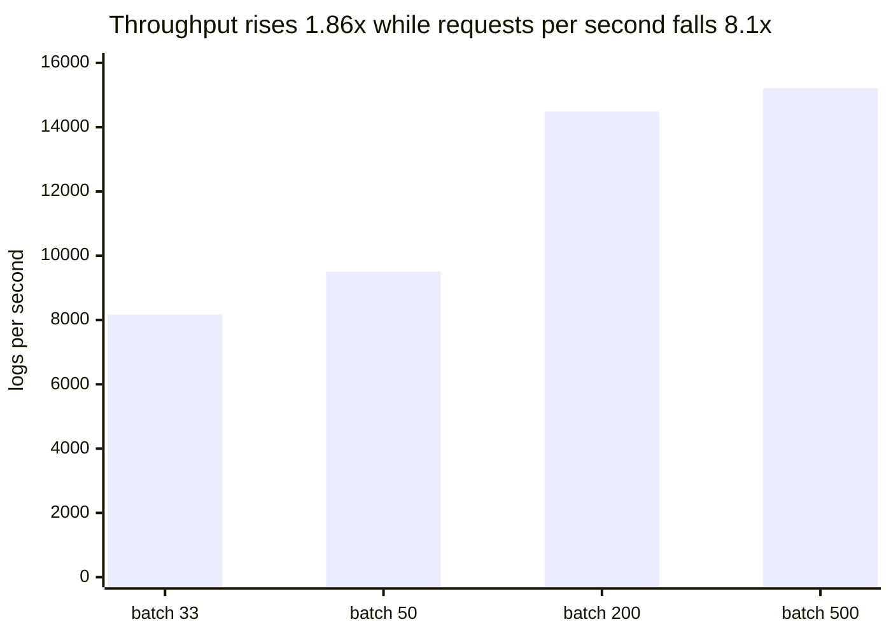
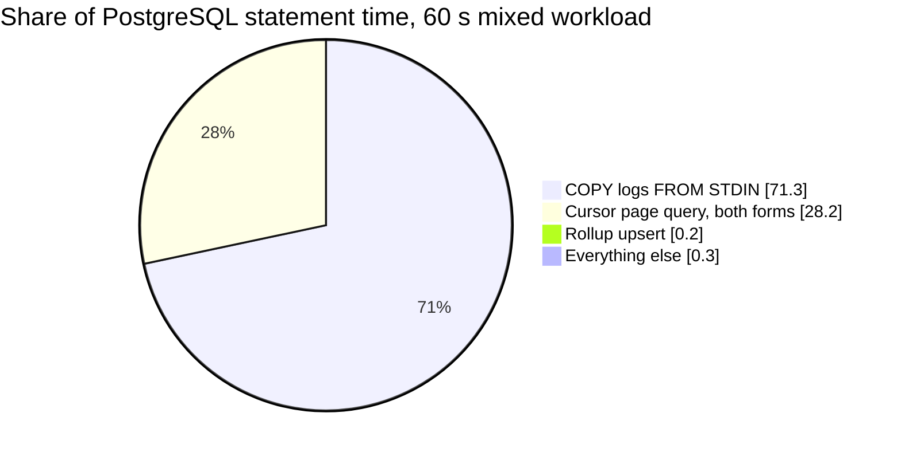

# Results — what was measured, in what order, and what it changed

> A visual summary of this project's evidence. Every figure below traces to a
> file in this repository, and each section names its source. Nothing here is
> new measurement — this file only *presents* what
> [`docs/test_results/`](test_results/), [`bench/results/`](../bench/results/),
> [`bench-runs/`](../bench-runs/) and
> [`DESIGN-DECISIONS.md`](DESIGN-DECISIONS.md) already record.
>
> Companion document: [`SCHEMA.md`](SCHEMA.md) — how the schema came to be, and
> how it is normalized.

**Two harnesses measured this service, and they are not interchangeable.**

| | harness | status | evidence |
| --- | --- | --- | --- |
| **1** | **The official benchmark CLI, run locally** | **the required source of truth** | **6 consecutive runs**, Part I |
| 2 | A hosted evaluation service | retired mid-project; runs are historical | 7 submissions, Part II |

The hosted service was withdrawn during the project and local CLI runs became
the required measurement. Part I is therefore the result. **Part II is not
discarded** — it is the record of how the service got from its first measurement
to its last, and it contains every wrong turn worth showing.

---

## 0. At a glance

| | |
| --- | ---: |
| Project span | **2026-08-14 → 2026-08-21** (8 days) |
| Commits on `main` | **74** |
| Branches on the remote | **15** — 7 experiment, 5 pinned one per submission, 3 working |
| Individually recorded benchmark runs (`runs.csv`) | **164** |
| Distinct runs of the official benchmark CLI | **12** |
| Historical runs on the hosted service | **7** |
| Narrative measurement write-ups | **14** |
| Design decisions recorded with evidence | **19** |
| Optimization candidates catalogued, ranked and dispositioned | **19** |
| Reference books reviewed against the requirements | **4** |
| Hypotheses proposed and then killed by measurement | **8** |
| Defects deliberately injected to prove the tests can fail | **10** |

**Final state of the gates**

```
Correctness, official CLI           15 / 15 checks   ████████████████████████████████████████ 100%
Reliability, official CLI           20 / 20          ████████████████████████████████████████ 100%
Automated test suite                41 / 41 tests    ████████████████████████████████████████ 100%
Reliability probe script            73 / 73 checks   ████████████████████████████████████████ 100%
Failure drill                       398,600 / 398,600 acknowledged rows persisted
```

---
---

# Part I — The result

## 1. Six consecutive runs of the official CLI

The measurement of record, taken 2026-08-21 in one session at commit `1b6ee2d`,
seed `6122026`, `--full --runner docker`.



**Documented configuration, `--generator-cpus 4`:**

| category | run 1 | run 2 | run 3 | mean | spread |
| --- | ---: | ---: | ---: | ---: | ---: |
| **Total** | **96.11** | 94.88 | 96.04 | **95.68** | 1.23 |
| Correctness /15 | 15.00 | 15.00 | 15.00 | **15.00** | **0.00** |
| Performance /50 | 46.47 | 45.80 | 46.49 | 46.25 | 0.69 |
| Queries /15 | 14.64 | 14.08 | 14.55 | 14.42 | 0.56 |
| Reliability /20 | 20.00 | 20.00 | 20.00 | **20.00** | **0.00** |
| machine speed | 0.1352 | 0.1202 | 0.1220 | 0.1258 | 0.0150 |

```
                          0        25       50       75      100
run 1        96.11       ██████████████████████████████████████▍
run 2        94.88       █████████████████████████████████████▉
run 3        96.04       ██████████████████████████████████████▍
mean         95.68       ██████████████████████████████████████▎
maximum     100.00       ████████████████████████████████████████
```

Every run was `eligible`, with **no cap applied**.

### The four numbers that matter most

**Correctness and Reliability were perfect in all six runs, with zero variance.**
Not "high" — identical, run after run.

**Ingest throughput is deterministic.** The load scenario returned
**14,999 logs/s at 0.000% errors in every one of the six runs** — hitting the
15,000/s target to within 0.006%, six times consecutively.

**Eventual consistency passed in every scenario of every run** — 24 of 24.

**The service was never the limiting factor.** In all six runs, across all four
scenarios, the report records `serviceLimited: false`. On stress, spike and
breakpoint it records `generatorLimited: true` — the load generator could not
start every scheduled iteration, because k6's iteration startup is bound by
single-core speed on this host.

> **This is the most important caveat in the file, and it cuts in our favour.**
> Performance (45.59–46.49) and Queries (13.85–14.64) are **floors, not
> ceilings.** Three of the four scenarios were capped by the measuring
> instrument, not by the service.

### Per-scenario detail, all six runs

| scenario | logs/s | errors | request p95 | aggregate p95 | limited by |
| --- | ---: | ---: | ---: | ---: | --- |
| load | 14,999 in all six | **0.000%** in all six | 191–272 ms | 20–64 ms | nothing |
| stress | 20,549–20,924 | **0.000%** in all six | 422–979 ms | 37–63 ms | generator |
| spike | 15,124–15,331 | **0.000%** in all six | 242–733 ms | 23–44 ms | generator |
| breakpoint | 22,105–23,091 | 3.41–7.40% | 1,553–1,868 ms | 68–106 ms | generator |

### What the six runs establish about their own reliability

Two findings that only appear because the run was repeated six times:

**Raising `--generator-cpus` from 4 to 6 made things worse.** The follow-up set
scored 94.93 / 94.67 / 94.73, mean **94.78** — 0.90 below the baseline mean, and
it **did not clear the generator warning**. k6's iteration startup is bound by
single-core speed, not core count. **Keep the flag at 4.**

**A stable total hides churn rather than proving its absence.** The totals span
1.23 while the tails underneath swing far wider — spike p95 **242–733 ms** (115%
spread), load aggregate p95 **20–64 ms**, breakpoint error rate **3.41–7.40%**.
Run 2 is the outlier on nearly every metric at once, and the machine-speed probe
does not explain it: run 3 measured almost the same speed factor and scored 1.16
higher.

**Not a clean room.** A browser and a desktop application ran throughout the
session. The guidance says to close everything else; one of them hosted the
session and could not be closed. That is the most likely source of run 2's
wobble and of the generator shortfall, and it is recorded rather than omitted.

*Source: [`BENCHMARK-RESULTS.md`](../bench-runs/BENCHMARK-RESULTS.md), six JSON
reports and the extractor beside them, all at commit `1b6ee2d`.*

---

## 2. The build-gate series — six builds inside one band

Before the session above, the same CLI was the regression gate on every build.
Same command and seed each time.

| build | total | Performance | Queries | aggregate p95 | request p95 | correctness | machine speed |
| --- | ---: | ---: | ---: | ---: | ---: | ---: | ---: |
| baseline 1 | 95.088 | 46.007 | 14.081 | 51.05 ms | 234.3 ms | 15/15 | 0.1192 |
| baseline 2 | 95.787 | 46.526 | 14.261 | 41.05 ms | 187.6 ms | 15/15 | 0.1209 |
| baseline 3 | 94.933 | 45.977 | 13.956 | 58.00 ms | 237.0 ms | 15/15 | 0.1190 |
| stage 1, one round trip | 95.598 | 46.408 | 14.190 | 45.00 ms | 197.4 ms | 15/15 | 0.1197 |
| counters | 95.480 | 46.092 | 14.388 | **34.00 ms** | 226.6 ms | 15/15 | 0.1201 |
| millisecond edge | 95.276 | 46.212 | 14.064 | 52.00 ms | 215.8 ms | 15/15 | **0.1246** |

Every build landed inside the **94.933–95.787** band the three baselines
established, which is exactly what a regression gate exists to confirm. Load
throughput was 14,999 /s at 0.00% errors in all but one run, and eventual
consistency passed **4 of 4 scenarios in every single run**.

**Two honesty notes carried from the sources:**

- The millisecond-edge run sat at machine speed **0.1246, outside** the
  0.1190–0.1209 band every earlier run held. The host was faster that session,
  so **its latency columns are not comparable** to the rows above it. Its
  aggregate p95 of 52 ms against the counters run's 34 ms is not evidence of a
  regression and not evidence of anything else.
- One metric moved the wrong way and is recorded rather than dropped:
  `readAfterWriteSuccessRate` fell to **0.143** against a 0.178–0.198 baseline
  range. It carries zero weight in the total, and nothing that mattered moved
  with it.

---
---

# Part II — How it was reached

> The runs in this part were measured by a hosted evaluation service that was
> **retired during the project**. They are not the result. They are kept because
> they are the record of how the service was improved, and because several of
> their conclusions were overturned by later measurement — which is the part
> worth showing.

## 3. The optimization journey



```
                                          0        25       50       75      100
pre-optimization baseline       39.30    ███████████████▋
run 4   write-path phase 1      39.49    ███████████████▊
run 5   read-path bundle        40.56    ████████████████▎
run 6   in-process aggregate    73.63    █████████████████████████████▍
run 7   millisecond edge        88.98    ███████████████████████████████████▋
```

**+49.68 over four changes — and the shape matters more than the total.** Three
of those four changes were worth about a point between them. One was worth
**33.07** and the next **15.35**. The work that mattered was not the work that
looked promising at the start; §13 and §14 are the record of how the difference
was found.

| run | commit | what shipped | Correctness /15 | Reliability /20 | Performance /50 | Queries /15 | total |
| --- | --- | --- | ---: | ---: | ---: | ---: | ---: |
| 4 | `1634a98` | write-path phase 1 — index removal, WAL tuning | 15.00 | 20.00 | 4.49 | 0.00 | **39.49** |
| 5 | `056a74e` | read pool cut to 2, 8 s read timeout, one-round-trip aggregate | 15.00 | 20.00 | 5.56 | 0.00 | **40.56** |
| 6 | `feb71be` | per-second in-process aggregate counters | 15.00 | 20.00 | 38.63 | 0.00 | **73.63** |
| 7 | `dee005f` | per-millisecond edge layer | 15.00 | 20.00 | **45.00** | **8.98** | **88.98** |

> The first point, **39.30**, is recorded only as the start of the phase-1 delta
> `39.30 → 39.49`. No run number and no per-category split are recorded for it,
> so it appears in the chart and not in the table.

**Correctness and Reliability were at maximum in every recorded run**, on this
harness as on the other. All movement lives in the two performance buckets.

*Sources: [`run5-read-path.md`](test_results/run5-read-path.md),
[`run7-platform.md`](test_results/run7-platform.md), `agents.md` Status.*

---

## 4. Chronology



---

## 5. The final submission in detail

**The load scenario across three runs**

| metric | run 5 | run 6 | run 7 | run 5 → run 7 |
| --- | ---: | ---: | ---: | --- |
| accepted throughput | 4,169 /s | 14,285 /s | **14,999.17 /s** | **3.6×**, at the offered ceiling |
| HTTP error rate | 27.48% | 0.00% | **0.00%** | eliminated |
| request latency p95 | 2,078 ms | 588 ms | **8.18 ms** | **254×** |
| ingestion latency p95 | 65 ms | 72 ms | **8.90 ms** | 7.3× |
| aggregate latency p95 | 2,170 ms | 604 ms | **1.00 ms** | **2,170×** |
| PostgreSQL CPU, average | 78.21% | 76.17% | **21.50%** | stopped being the pinned resource |

```
request latency p95, log scale
                     1 ms      10 ms     100 ms     1 s       10 s
run 4    4,111 ms    ····································█
run 5    2,078 ms    ·································█
run 6      588 ms    ····························█
run 7     8.18 ms    ·········█
full marks at        ····················┤ 100 ms and below
```

**All four scenarios in the final run**

| scenario | logs/s | errors | request p95 | ingest p95 | aggregate p95 | PG CPU avg / max | app CPU avg / max |
| --- | ---: | ---: | ---: | ---: | ---: | ---: | ---: |
| load | 14,999.17 | 0.00% | 8.18 ms | 8.90 ms | 1.00 ms | 21.50 / 33.41 | 18.92 / 31.46 |
| stress | 19,664.00 | 0.00% | 38.03 ms | 513.47 ms | 6.00 ms | 29.27 / 64.44 | 22.52 / 44.21 |
| spike | 15,124.00 | 0.00% | 10.08 ms | 56.47 ms | 2.00 ms | 20.16 / 50.06 | 17.35 / 41.83 |
| breakpoint | 19,132.50 | 0.00% | 469.92 ms | 1.09 s | 10.00 ms | 25.34 / 80.23 | 19.74 / 41.63 |

Zero rejected logs and 100% POST success in all four. Application memory peaked
at 114 MiB against a 256 MiB cap; PostgreSQL at 544 MiB against 1 GB.

### The forecast was written down before the run

This is the strongest single piece of method evidence in the project. The
previous run's write-up recorded a per-bucket prediction *in advance*; setting
the expectation before the measurement is what makes the comparison worth
anything.

| bucket | forecast | delivered | |
| --- | ---: | ---: | --- |
| Queries — aggregate p95 | 9.00 | **8.98** | 1.00 ms leaves 0.018 unclaimable |
| Performance — latency p95 | 5.42 | **5.42** | exact |
| Performance — throughput | 0.95 | **0.95** | exact |
| Performance — errors | hold at maximum | **held at 0.00%** | defended |
| Queries — eventual consistency | 6.00 | **0.00** | explicitly not worked on |
| Performance — sustained bonus | 5.00 | **0.00** | explicitly not worked on |

**+15.35 delivered against +15.37 forecast for the work actually done.** The two
forecasts that missed are the two nobody worked on.

*Source: [`run7-platform.md`](test_results/run7-platform.md).*

---

## 6. Why the two harnesses disagree

This is the most instructive measurement lesson in the project, and it is the
reason Part I and Part II are kept apart rather than averaged.

The same four builds, measured both ways. One instrument sits flat inside its
own noise band while the other moves 49 points.



| build | official CLI, local | hosted service | gap |
| --- | ---: | ---: | ---: |
| `e84b6de` baseline, mean of 3 | 95.27 | 39.49 | 55.8 |
| `056a74e` one round trip | 95.60 | 40.56 | 55.0 |
| `feb71be` in-process counters | 95.48 | 73.63 | 21.9 |
| `dee005f` millisecond edge | 95.28 | 88.98 | **6.3** |

**The mechanism, exactly.** The CLI ships a tester whose aggregate window ends
at a fixed instant *in the future*. The hosted service ran an earlier one that
read the **clock**. Under the first, the aggregate endpoint issues **zero** SQL
statements and reports 34 ms. Under the second it issued one fringe query per
request and reported **604 ms** — same code, same throughput, on hardware eight
times slower.

Neither number was wrong. They were answers to different questions.

This cost a submission's worth of misplaced confidence: the local gate predicted
"no change within noise" immediately before a 33-point jump on the other
harness. It is now rule 10 of the measurement standard — *a latency figure from
one harness is not evidence about another until you have checked that both
probes ask the same question.*

*Sources: [`aggregate-fringe.md`](test_results/aggregate-fringe.md) "Why the
local gate is blind"; `agents.md` measurement standard rule 10.*

---

## 7. Choosing the stack — the full 2×2

Four builds, each on its own branch, at the same batch size, on an exclusive
host, with the running build verified **from inside the container** every run.

**Throughput at batch 33, logs/s — application-limited in every cell**

| | Express | Fastify | framework gain |
| --- | ---: | ---: | ---: |
| **Node 22.18** | 8,603 | 11,233 | **+30.6%** |
| **Bun 1.3.14** | 18,361 | 20,095 | **+9.4%** |
| **runtime gain** | **+113%** | **+79%** | |

```
                              0        5k       10k      15k      20k
Express + Node    8,603 /s    █████████████████▎
Fastify + Node   11,233 /s    ██████████████████████▍
Express + Bun    18,361 /s    ████████████████████████████████████▊
Fastify + Bun    20,095 /s    ████████████████████████████████████████
target           15,000 /s    ┄┄┄┄┄┄┄┄┄┄┄┄┄┄┄┄┄┄┄┄┄┄┄┄┄┄┄┄┄┄┤
```

**The runtime is the larger effect by an order of magnitude, and the two changes
are not additive.** Fastify is worth +30.6% on Node but only +9.4% on Bun —
Bun's HTTP layer is already fast, so there is less framework overhead left to
remove. That is a finding the full 2×2 produces and a single A/B cannot.

### Throughput was not the deciding number

A harness that only ingests cannot see the thing this service exists to do. A
mixed-workload harness that **reads while it writes** was built for the
decision, and it widened the margin by an order of magnitude:

| reads under sustained ingest | Express + Node | Fastify + Bun | factor |
| --- | ---: | ---: | ---: |
| drain pages/s | 0.96 / 1.01 / 1.09 | **19.64 / 19.88 / 21.68** | **~19×** |
| page latency p95 | 802 / 892 / 897 ms | 85.8 / 88.7 / 89.8 ms | ~10× |
| aggregate latency p95 | 617 / 879 / 2,318 ms | 86.1 / 94.8 / 216.6 ms | ~7× |
| **rows visible within 30 s** | **14.5 / 14.7 / 15.3%** | **99.6 / 99.7 / 99.8%** | — |
| stopped because | the clock ran out | **it ran out of rows** | — |
| ingest throughput | 8,030 / 8,590 / 8,896 /s | 14,919 / 14,939 / 14,989 /s | ~1.75× |

```
rows visible inside the 30 s window   0%                                    100%
Express + Node       14.8% mean       █████▉
Fastify + Bun        99.7% mean       ███████████████████████████████████████▉
```

Express was not merely slower — it was **starved**: zero pages completed for
roughly fifteen-second stretches while ingest held the CPU. Three interleaved
pairs, spread within each side 10–13% against a 19× effect.

**It also broke an assumed trade-off.** The concern going in was that faster
ingest makes readable-freshness worse, because more accepted rows means more for
a reader to traverse. Fastify + Bun accepted **1.75× more rows** and still made
**99.7%** of them visible. The two were only in tension while the reader was
losing a CPU fight it now wins.

*Sources: [`fastify-bun-results.md`](test_results/fastify-bun-results.md),
[`mixed-workload-baseline.md`](test_results/mixed-workload-baseline.md),
[`bun-branch.md`](bun-branch.md), design decision 1.*

---

## 8. The batch-size curve — why one operating point is not a result

All four points taken in one continuous session, on one database, zero errors
throughout.

| batch | throughput | requests/s | ingest p50 / p95 / p99 | aggregate p95 |
| ---: | ---: | ---: | --- | ---: |
| **33** | 8,169.8 /s | 247.6 | 378 / 604 / 707 ms | 204 ms |
| 50 | 9,504.1 /s | 190.1 | 487 / 790 / 916 ms | 263 ms |
| 200 | 14,487.4 /s | 72.4 | 1,285 / 1,634 / 2,236 ms | 606 ms |
| 500 | 15,216.6 /s | 30.4 | 3,075 / 3,712 / 3,937 ms | 1,307 ms |



Fitting `latency = a + b · batch` to the p50 column gives **a ≈ 187 ms fixed per
request** and **b ≈ 5.8 ms per log** — a model that predicts 476 ms at batch 50
against 487 measured, and 1,342 ms at batch 200 against 1,285 measured.

Two consequences that shaped every later measurement:

- At batch 33 about **half** of each request's latency is the size-independent
  term; at batch 500 it is under 6%. **An HTTP-layer change therefore looks
  about four times better at batch 33 than at batch 200** — the HTTP layer is
  19.3% of on-CPU time at the first point and 7.5% at the second.
- The per-log term implies a ceiling near **16,600 logs/s** at this concurrency,
  which is exactly where batch 500 is already flattening.

**So every stack comparison in §7 is reported at two batch sizes**, and the
measurement standard requires it. Reporting batch 33 alone would have been the
most flattering framing available.

*Source: [`batch33-and-cpu-profile.md`](test_results/batch33-and-cpu-profile.md) §1.*

---

## 9. Where the database's time goes



**Writes are ~71% of database time, reads ~28%.** Two things this settles: the
rollup design pays for itself, answering aggregate queries for 0.2% of database
time; and the read path is doing nothing pathological, at 7.4–8.9 ms per
1,000-row page and a 96.2% buffer hit ratio.

### The finding: 173 MB of index maintained for zero scans

| index | size | scans in this run |
| --- | ---: | ---: |
| `logs_..._service_level_timestamp_id_idx` | **116 MB** | **0** |
| `logs_..._attributes_idx` (GIN) | **57 MB** | **0** |
| `logs_..._pkey` | 40 MB | 5,095 |

Both were maintained on every inserted row, inside the `COPY` that owns 71.3% of
database time.

**The limit of that finding, stated plainly:** this workload's reads are an
*unfiltered* cursor walk plus aggregates. They never filter by `service`, by
`level`, or by an attribute. So these indexes are not shown to be useless — they
are shown to be **pure write cost under this query mix**. Which one could
actually be dropped took another 30 runs to establish; see §10.

*Source: [`postgres-profile.md`](test_results/postgres-profile.md). Index
rationale: [`SCHEMA.md`](SCHEMA.md) §1.*

---

## 10. Pricing two indexes — 30 runs, split verdict

**Step 1, a screen and labelled as one.** Both indexes dropped at once —
deliberately two variables, to decide whether the effect justified a full
matrix.

| | baseline | both dropped | |
| --- | ---: | ---: | --- |
| PostgreSQL CPU avg | 77.0–79.6% | 54.2–55.1% | **−30.3%** |
| WAL generated | 900.7–901.1 MB | 393.4–394.0 MB | **−56.3%** |
| Ingest p95 | 470.8–572.2 ms | 331.7–368.2 ms | **−32.7%** |
| **Ingest throughput** | 14,948–14,992 /s | 14,962–14,997 /s | **0.0%** |

That last row is why a screen is not a decision: at a fixed offered rate both
sides met the offer, so throughput read zero.

**Step 2, each index measured against the query shape it exists to serve.** The
two priced out oppositely:

| index removed | its own query shape | result |
| --- | --- | --- |
| `logs_service_level_page_idx` | service-filtered cursor walk | **no regression** — 12.6–13.1 pages/s before, 12.4–14.4 after; every band overlapping |
| attributes GIN | selective attribute point lookup | **42.7× slower at p50** — 2.4–2.7 ms becomes 106.1–110.6 ms |

**One deleted, one kept.** Dropping the service index bought **−18% WAL per
row** and **+12.4% / +25.1%** ingest throughput at batch 33 / 200, every
normalized band separated.

This is the worked example of measurement-standard rule 8 — *a write-path result
without its read-path pair is not a decision* — and of why this call cost 30
runs instead of 2.

*Source: [`index-removal.md`](test_results/index-removal.md), design decision 6.*

---

## 11. WAL tuning — 12 runs, one adopted, one rejected

| item | change | verdict |
| --- | --- | --- |
| `max_wal_size` | 2 GB → 8 GB | **Reject.** Halves the checkpoint count and cuts WAL 7.2% per row, but throughput, both ingest percentiles, drain and database CPU all overlap. WAL bandwidth is not the constraint at a 96.2% buffer hit ratio |
| `wal_buffers` | 8 MB → 16 MB | **Adopt, on qualified evidence.** Ingest p95 −16.6%, and the real effect is variance collapse — throughput spread 25% at 8 MB against 0.9% at 16 MB, with the 8 MB best run matching 16 MB |

**The qualification is kept deliberately:** the p95 bands separate by only 0.5%,
which is inside session noise. An adopted change with weak evidence is recorded
as weak, not rounded up.

**Two findings that outlasted both verdicts:**

1. **A 60 s run never triggers a size-driven checkpoint.** The trigger distance
   is ~1,078 MB of WAL; 60 s at the target produces ~500 MB. A standing claim
   that checkpoints were size-driven at ~3.5 minutes and were biting our runs
   described something that **was not happening at all**.
2. **Sustained saturation sheds, and 60 s hid it.** At 120 s against a 45,000 /s
   offer the service refuses ~34% of requests — backpressure working as
   designed, zero read errors. No earlier run was long enough to reach it.

*Source: [`wal-tuning.md`](test_results/wal-tuning.md), design decision 13.*

---
---

# Part III — How the evidence was made trustworthy

## 12. Making the tests able to fail — 10 injected defects

A green test that cannot fail is worse than no test. Two rounds of mutation
testing were run against the aggregate gates, and every injected defect failed
the suite.

**The rounds overlap.** The counters round injected the first four; the
edge-layer round injected ten **including those same four**. The distinct total
is therefore **10**, not 14.

| # | injected defect | caught by | round |
| ---: | --- | --- | --- |
| 1 | interior scan includes one extra second | randomised sweep | both |
| 2 | left-edge fragment never issued | randomised sweep | both |
| 3 | coverage floor ignored | mechanism test | both |
| 4 | service-only filter ignored | randomised sweep | both |
| 5 | millisecond floor ignored | boundary test | edge |
| 6 | total used under a service filter | filtered-decline test | edge |
| 7 | edge upper bound inclusive | rows-on-bounds test | edge |
| 8 | edge lower bound exclusive | rows-on-bounds test | edge |
| 9 | millisecond layer never written | zero-statement test | edge |
| 10 | inverted-interior guard removed | sub-second window test | edge |

**Two of the ten survived the first version of the gate**, and both drove a new
test rather than a shrug: the fixture originally stepped 7 ms at a time so no row
ever sat exactly on a bound, and the randomised sweep produces a sub-second
window only about **0.6%** of the time. The gate could not fail in exactly the
two places the new code was most likely to be wrong.

A flaky test was also found and fixed in the same work — its result depended on
`Date.now() % 1000`, so it passed or failed according to when it ran. The
fixture is now anchored to a real second boundary.

*Sources: [`aggregate-cache.md`](test_results/aggregate-cache.md),
[`aggregate-fringe.md`](test_results/aggregate-fringe.md).*

---

## 13. Eight hypotheses killed by measurement

Before the cause of the read-path problem was found, eight explanations were
proposed and eliminated. None may be re-proposed without new evidence.

| candidate explanation | how it died |
| --- | --- |
| write path / WAL / index cost | local ingests 22,000 logs/s on the same code |
| our CPU caps being too tight | the CLI enforces identical caps and we hit target under them |
| response-shape mismatch | the same JSON scores 14.1/15 on Queries locally |
| the `q` substring scan | the graded aggregate probe issues no `q` and no filters |
| rollup hot-key contention | the batcher is single-flight, so flushes never overlap |
| fixture seed / service cardinality | four seeds, identical results every time |
| rollup table size | 691,216 rows / 112 MB still answers in **2.47 ms** by index scan |
| retention worker interference | hourly timer against a fresh volume; a ~13 min run never fires it twice |

The resource profile was the clue that survived: the application sat at **5.42%
of its 0.5-CPU cap** while PostgreSQL ran **75.60% average and 100.38% peak** of
its own. The application was idle and the database was saturated.

*Source: `agents.md`, the elimination table.*

---

## 14. Conclusions this project got wrong, and corrected

These are kept because the corrections are part of the result. The repository's
own rules require keeping them, and several read as embarrassing.

| what was believed | how it died |
| --- | --- |
| GET failures track offered load, so contention is about arrival rate | **falsified by run 6** — removing the aggregate's database work took errors to 0.00% while throughput rose 3.4× at unchanged database CPU |
| eventual consistency is a by-product of database headroom | **falsified by run 7** — headroom arrived in abundance (21.5% database CPU, 0.00% errors, 1 ms aggregates) and it did not move at all |
| checkpoints were size-driven at ~3.5 min and were biting our runs | they were **not happening at all**; a 60 s run never reaches the ~1,078 MB trigger |
| "tens of percent of host drift" explains the noise | wrong — it came from comparing **two different builds under the same label**. Real noise is ~6% within a session, ~11% across |
| request latency gates throughput on the load scenario | wrong — the generator's VU pool is `max(preAlloc, latency-derived)`, and on load preAlloc wins. The coupling binds only in stress |
| a branch name proves which build is running | a commit that landed on the wrong branch **inverted an entire A/B** and produced a confident, exactly backwards conclusion |
| the failure drill was passing | it was **vacuous** — it sent SIGTERM to a container that did not exist, with the error swallowed, so the shutdown gate passed by never running |
| the inverted-interior guard needed `<=` | too strict — equal bounds tile the window exactly, and only a *strict* inversion double-counts |
| one harness predicts another's behaviour | rule 10 — the local gate predicted "no change within noise" immediately before a 33-point jump elsewhere |

Three of these are not minor: an inverted A/B, a gate that passed by never
running, and a diagnosis that was right about contention but wrong about its
mechanism. Each produced a rule in §15.

---

## 15. The measurement standard

Ten rules a result must satisfy before it can inform a merge, a revert, or a
claim. **Each exists because its absence produced a wrong answer here.**

| # | rule | the incident behind it |
| ---: | --- | --- |
| 1 | Interleave the two builds, never all of A then all of B | ordering effects and table growth can invent a result |
| 2 | Three repeats per side, minimum | two cannot separate a 10% effect from 6% noise |
| 3 | Clean volume per run, row count recorded | a warm or growing database is a different experiment |
| 4 | Verify the build **from inside the container**, every run | a commit on the wrong branch inverted an entire A/B |
| 5 | One variable at a time | or say explicitly that two moved, as run 5 does |
| 6 | One stack up at a time | two compose projects contaminate the host and the resource capture |
| 7 | Report the spread, not just the mean | a cell with non-zero errors is not a throughput number |
| 8 | **Pair the sides** — a write-path result needs a read-path number | dropping two indexes cut CPU 30% and WAL 56%, and said nothing about whether they could be dropped |
| 9 | Score with the official CLI, not only our own harness | our harness saturates its own ceiling and reports ~0.0% on throughput A/Bs by construction |
| 10 | One harness cannot see everything another measures | it predicted "no change" before a 33-point jump |

**Measured noise, for calibration:** ~6% for a repeated build within a session,
~11% across sessions. Never compare against a number from an earlier session.

**The gates grew as the work did:** the test suite went **32 → 34 → 39 → 41**,
each step adding a gate that a specific change made necessary.

---

## 16. What is deliberately not claimed

An advisor should weigh this section as heavily as §1. It is what bounds
everything above it.

- **Part I's figures are floors, not ceilings** — but they are also not a clean
  room. Three of four scenarios were generator-limited in all six runs, and a
  browser and a desktop application ran throughout the session.
- **The historical submissions in Part II are directional.** One run per build,
  no repeats, so none of those deltas carries an error bar and the three-repeat
  rule is **not** met for them. Only Part I meets it.
- **Run 5's 31.7× ingestion improvement belongs to a bundle**, not to any one
  change. Three changes shipped in one submission because submissions were the
  scarce instrument. Attribution was deliberately spent, and no file claims
  otherwise.
- **No local measurement predicted the final submission.** The CLI reported
  95.276 for that build, indistinguishable from the previous one, because the
  tester it ships exercises a code path the change does not touch. The local
  gate proved the absence of a regression and nothing else — as recorded in
  advance, not in hindsight.
- **The write path was never optimized.** The rollup upsert still runs inside
  every flush transaction and flush concurrency is still 1. The ingestion-latency
  degradation under stress and breakpoint (8.90 ms → 513 ms → 1.09 s on the
  hosted harness) is unaddressed.
- **The two harnesses' totals are not comparable and were never averaged.** They
  are reported separately, in separate parts, for the reason §6 gives.

---

*Written 2026-08-21 as part of the documentation phase, after the final
submission and after the six-run session that is the measurement of record. It
records no new measurement. Where a source recorded a finding as uncertain,
falsified, or not-comparable, this file keeps it that way.*
