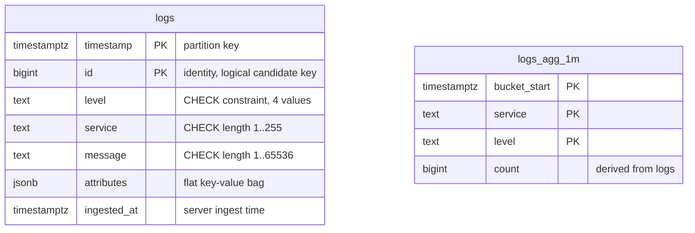
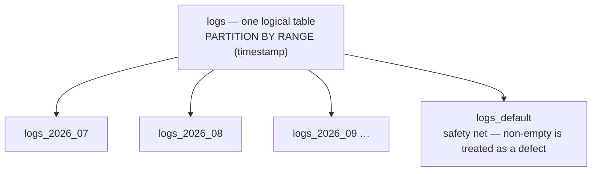
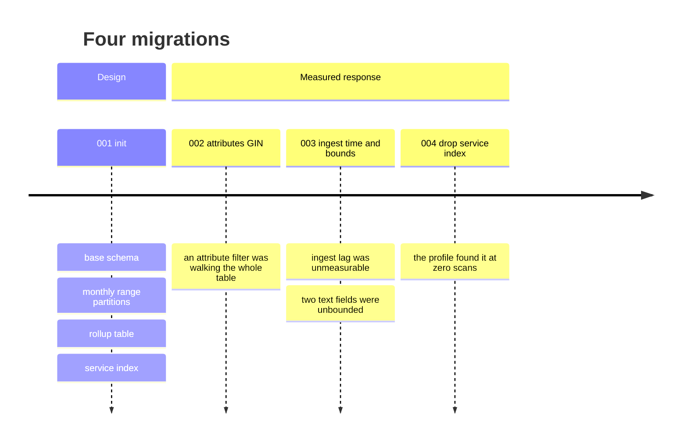
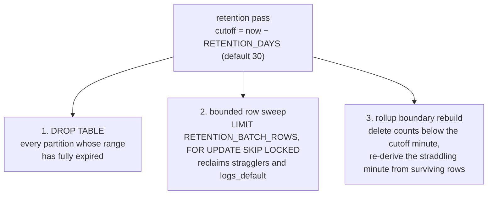

# The schema — how it came to be, and how it is normalized

> Companion to [`RESULTS.md`](RESULTS.md), which carries the measurements. This
> file answers the database question: what shape the schema is, where that shape
> came from, how it changed, and what normal form it is in.
>
> Every claim traces to a file, and each section names its source — **with one
> deliberate exception, §4**, which is analysis written for this document rather
> than a record of a past decision. It says so at its own head.

---

## 1. The schema as it ships

> **This is the effective post-migration state, not a copy of any one migration
> file.** `logs` is the composition of four migrations, and reading
> `001_init.sql` alone would be wrong on three counts — it lacks `ingested_at`,
> lacks the two length constraints, and still declares an index that has since
> been dropped. §5 carries the derivation.

```sql
-- Effective state of `logs` after migrations 001 + 002 + 003 − 004.
CREATE TABLE logs (
  timestamp   TIMESTAMPTZ NOT NULL,
  id          BIGINT GENERATED ALWAYS AS IDENTITY,
  level       TEXT NOT NULL CHECK (level IN ('debug','info','warn','error')),
  service     TEXT NOT NULL CHECK (length(service) > 0),
  message     TEXT NOT NULL CHECK (length(message) > 0),
  attributes  JSONB NOT NULL DEFAULT '{}'::jsonb
              CHECK (jsonb_typeof(attributes) = 'object'),
  ingested_at TIMESTAMPTZ DEFAULT clock_timestamp(),        -- added by 003
  PRIMARY KEY (timestamp, id),
  CONSTRAINT logs_service_length_chk CHECK (length(service) <= 255)   NOT VALID,
  CONSTRAINT logs_message_length_chk CHECK (length(message) <= 65536) NOT VALID
) PARTITION BY RANGE (timestamp);

-- The rollup is unchanged since 001.
CREATE TABLE logs_agg_1m (
  bucket_start TIMESTAMPTZ NOT NULL,
  service      TEXT NOT NULL,
  level        TEXT NOT NULL CHECK (level IN ('debug','info','warn','error')),
  count        BIGINT NOT NULL CHECK (count >= 0),
  PRIMARY KEY (bucket_start, service, level)
);
```

**Every object that actually exists at runtime**

| object | from | notes |
| --- | --- | --- |
| `logs`, range-partitioned on `timestamp`, monthly | 001 + 003 | 7 columns; 2 `NOT VALID` length constraints |
| `logs_pkey` `(timestamp, id)` | 001 | **is** the pagination index |
| `logs_attributes_gin_idx` — `gin (attributes jsonb_path_ops)`, `fastupdate = off` | 002 | the only other index on `logs` |
| ~~`logs_service_level_page_idx`~~ | 001, **dropped by 004** | removed on measurement — see §5 and [`RESULTS.md`](RESULTS.md) §8 |
| `logs_agg_1m` + its PK + `logs_agg_service_bucket_idx` | 001 | derived rollup |
| `logs_hot_attr_<key>_page_idx` | created at startup from `HOT_ATTRIBUTE_KEYS` | **ships disabled** — the list is empty by default |

### Two diagrams, because one would misrepresent the model

**Logical.** Two tables, and **no line between them** — there are no foreign
keys anywhere in the schema (verified: zero `REFERENCES` in
`src/db/migrations/`). That absence is the first thing to notice, and §4
explains why it is correct here rather than an omission.



**Physical.** Partition children are not related entities — they are the same
logical table stored in pieces. Drawing them in the ER diagram would imply a
relationship that does not exist.



**Why each column is the type it is**

| column | choice | reason |
| --- | --- | --- |
| `id` | `BIGINT` identity, **not** UUID | monotonic keys give B-tree insertion locality — new rows land at the right edge, pages stay dense, write amplification stays low. Random UUIDs fragment pages across every index. Rendered as a JSON *string* in responses so JavaScript loses no precision |
| `timestamp` + `id` | composite PK | it *is* the pagination index: a backward scan serves `ORDER BY timestamp DESC, id DESC` with no sort node, and `id` breaks ties deterministically when rows share a timestamp |
| `level` | `TEXT` + a `CHECK` constraint | the four permitted values are enforced inline by `CHECK (level IN (…))`, not by a lookup table and foreign key — see §4 |
| `attributes` | `JSONB`, original value types | a response must return `3` and `true`, not `"3"` and `"true"` |
| `ingested_at` | separate from `timestamp` | client event time and server ingest time are **two different facts**; keeping both is what makes ingest lag measurable at all |
| `count` | `BIGINT` | a 32-bit cast is an overflow risk at retention scale |

*Sources: `src/db/migrations/`, `plan/01-ARCHITECTURE.md` §3, README "Database
design".*

---

## 2. Where the schema came from — hypothesis before code

The schema was designed before it was written. `search_rnd/RND.md` §3 "Schema
and query direction" was committed **2026-08-15**; the first `src/` commit and
the first migration landed **2026-08-16**.

**What the research record proposed, before any code existed:**

| # | proposal | shipped? |
| ---: | --- | --- |
| 1 | partitioned `logs` table with time-range partitions, retention by dropping partitions rather than deleting rows | **yes**, granularity changed — §3 |
| 2 | `BIGINT GENERATED ALWAYS AS IDENTITY`, returned as a JSON string; cursor on `(timestamp, id)` descending, fetching `limit + 1` | **yes**, unchanged |
| 3 | keep original `attributes` JSONB for responses; add a second string-normalized representation *if* attribute equality needs indexing | **partly** — §3 |
| 4 | start with only indexes justified by required queries: time/id ordering, service + time/id, JSONB containment, trigram message search | **partly** — two of four ship |
| 5 | build every optional filter from fixed SQL fragments with bound parameters; attribute keys are values, never interpolated identifiers | **yes**, unchanged |
| 6 | normal WAL-backed tables and synchronous commits for crash-durable acknowledgement | **changed** — §3 |

**Four architecture conclusions the book review produced**, each of which
survives in the shipped design: `BIGINT` identity over random UUID for B-tree
insertion locality; bounded micro-batching through `COPY` into WAL-backed
tables, resolving each request only after its transaction commits; declarative
partitions created ahead of ingestion and never from a concurrent insert path;
and rollup tables kept as a *fallback* only if direct aggregation missed the p95
target — which it did, so the rollup shipped.

*Source: `search_rnd/RND.md` §3 and §7; git history for the dates.*

---

## 3. Four places the shipped schema diverges from the research

This is the schema's trial-and-error record. Each divergence was driven by a
measurement or by a constraint the research had not yet seen.

| research proposed | shipped | why it changed |
| --- | --- | --- |
| **daily** range partitions | **monthly** (`ensureMonthlyPartitions`) | partition count. An unfiltered descending page merge-appends across children, so dozens of daily children cost more per page than a handful of monthly ones |
| a second **string-normalized JSONB** column — proposed *conditionally*, "if benchmarked attribute equality needs indexing" | condition met, **different mechanism chosen**: original types kept, `attributes ->> key = $n` rechecked over a `jsonb_path_ops` GIN | the duplicate column would have stringified values, and responses must return `3` and `true`, not `"3"` and `"true"`. The GIN selects candidates by containment and the `->>` predicate rechecks them exactly — the index without the second column |
| **trigram GIN** for message substring search, in the initial index list | **not built** (verified: no `trgm` anywhere in `src/`) | no measured workload ever exercised `q`. Catalogued as speculative and deliberately left unbuilt rather than paying its write cost blind |
| **synchronous commits**, with the research explicitly warning *not* to describe asynchronous commit as crash-durable | `SET LOCAL synchronous_commit = off` **by default, but configurable** — `SyncCommit = "on" \| "off"` in `src/config.ts`, with `.env.example` documenting `on:` as *strictly crash-durable acknowledgement* | asynchronous commit removes the WAL flush wait from the write path while keeping crash recovery intact. `UNLOGGED` was rejected outright: an unclean crash **truncates the whole table**, demonstrated locally at 280,445 committed rows becoming 0 |

**The second row is not a reversal.** The research proposed the duplicate column
*conditionally*, and the condition was met — migration 002 measured an attribute
filter walking every one of 671,000 rows at ~158 ms. A different mechanism was
chosen to satisfy the same need, and it preserves value types the proposed
column would have destroyed.

### The fourth row needs stating precisely

This is a **weakening of a guarantee the research proposed**, taken deliberately
and documented rather than hidden. The exact position:

- Under `synchronous_commit = off`, a crash can lose the most recent
  already-acknowledged transactions. That is a real, deliberate exposure.
- **The failure drill does not test an unclean crash.** It exercises a graceful
  database stop, a database restart, and SIGTERM mid-ingestion. So "398,600 of
  398,600 acknowledged rows persisted" is evidence of **graceful-shutdown
  durability**, and must not be read as evidence of crash durability under the
  default profile.
- `SYNC_COMMIT=on` restores the stronger guarantee, and the repository documents
  it as the durable profile rather than pretending the default is one.

*Sources: `src/db/migrate.ts`, `src/config.ts`, `.env.example`,
`scripts/failure-drill.sh`, design decision 7.*

---

## 4. Normalization

> **Read this first.** No normal-form analysis exists anywhere in this
> repository. This section was **written for this document** and assesses the
> shipped schema; it is not a record of a decision taken at design time. Every
> figure it cites as a *measurement* still traces to a file.

### The key structure, stated precisely

`id` is `BIGINT GENERATED ALWAYS AS IDENTITY`, so it is factually unique. But
**no `UNIQUE` constraint on `id` alone is declared anywhere** — and on a
partitioned table PostgreSQL *cannot* declare one, because every unique
constraint must contain the partition key. Therefore:

- the **logical candidate key is `{id}`** — minimal and irreducible;
- the **declared primary key `(timestamp, id)` is a superkey, not a candidate
  key.** It was chosen for two physical reasons: it *is* the pagination index,
  and the partition key must appear in it.

### Normal form

Assessed against the candidate key `{id}`, every non-prime attribute —
`timestamp`, `level`, `service`, `message`, `attributes`, `ingested_at` — is
fully functionally dependent on it, with no transitive dependency, and every
determinant is a superkey. **`logs` is in BCNF.**

**The subtle part, stated rather than glossed:** those non-key attributes *do*
depend on `id` alone, which is a proper subset of the declared primary key. That
looks like a partial dependency, and under a naive reading it would be a 2NF
violation. It is not one — because 2NF is defined against **candidate** keys,
and `(timestamp, id)` is not a candidate key. It is a superkey chosen for the
access path. The distinction is the whole answer.

`logs_agg_1m` has PK `(bucket_start, service, level)`, which is minimal, and its
one non-key attribute `count` depends on the whole of it. **Also BCNF.**

**So both tables are individually in BCNF.** The denormalization in this design
is not *inside* either table. It is exactly two things.

### The two deliberate denormalizations

| # | what | what it costs | why it is right here |
| ---: | --- | --- | --- |
| 1 | `attributes` as JSONB | departs from 1NF atomicity; storage overhead on top of the raw values; an unconfigured attribute key is a scan, not an indexed lookup | the contract accepts arbitrary client-supplied keys. A relational decomposition would need an EAV side table and a join per filter on the hot read path. The bag is documented as **flat** — no nesting — and values keep their original types |
| 2 | `logs_agg_1m` as derived data | duplicates information already in `logs`; must be maintained on every write and swept by retention | it answers aggregate queries for **0.2%** of database time by reading the rollup instead of raw rows. It is upserted **inside the same transaction** as the raw rows, so committed counts and committed rows can never diverge — the redundancy is transactionally consistent by construction, not eventually |

### Why lookup tables for `service` and `level` would be wrong here

The obvious 3NF move is a `services` table and a `levels` table with foreign
keys. Against this workload it buys nothing and costs the constrained resource:

- **There is no update anomaly to prevent.** `logs` rows are never updated — the
  only writes are `COPY` inserts and retention deletes. *(Scoped deliberately:
  `logs_agg_1m` **is** updated, by `ON CONFLICT … DO UPDATE` on every flush and
  by the retention rebuild. The append-only claim is about `logs`.)*
- **The integrity is already held.** `CHECK (level IN ('debug','info','warn','error'))`
  gives exactly what a `levels` table would, enforced by the database, with no
  join.
- **The cost lands on the wrong resource.** The write path owns **71.3%** of
  database time, and the measured cost of maintaining *one* additional B-tree on
  this table was **18% more WAL per row** and 12–25% of ingest throughput.
  Foreign-key maintenance and the index a FK requires would be charged against
  precisely the resource that was the constraint — to buy integrity already held,
  and to add a join to every read.
- **This is an append-only event store, not an OLTP domain model.** `service`
  and `level` are not entities with their own lifecycle; they are attributes of
  an immutable event.

**The honest counterweight:** `service` is a repeated string on every row, so
this does cost storage that a lookup table would save. That cost is accepted,
and it is the trade being made — not an oversight.

---

## 5. Evolution — four migrations, each with its trigger



| migration | change | trigger | measured result |
| --- | --- | --- | --- |
| `001_init` | base schema, partitioning, rollup, service index | initial design from the research record | — |
| `002_attributes_gin` | `jsonb_path_ops` GIN, `fastupdate = off` | an attribute filter had no index and fell back to walking the table, paid on a hit as well as a miss | lookup **~158 ms → ~0.4 ms** at 671k rows, for ~**4.5%** of ingest throughput. Leaving `fastupdate` **on** cost **more than half** the achievable throughput: 6.3k logs/s at 83% database CPU, against 10.5k at 41% with it off |
| `003_ingested_at_and_field_bounds` | `ingested_at`; length ceilings on `service` and `message` | ingest lag could not be measured; a single multi-megabyte field was accepted and TOASTed | written as **two statements** — see the callout below |
| `004_drop_service_level_page_idx` | drop `logs_service_level_page_idx` | the profile found it at **zero scans** while occupying 116 MB and being maintained on every inserted row | **−18% WAL per row**, **+12.4% / +25.1%** ingest throughput at batch 33 / 200, and a service-filtered walk **unchanged** — 12.6–13.1 pages/s before, 12.4–14.4 after |

### The migration worth reading twice

Migration `003` adds `ingested_at` in **two statements** rather than the obvious
one-liner:

```sql
ALTER TABLE logs ADD COLUMN IF NOT EXISTS ingested_at TIMESTAMPTZ;
ALTER TABLE logs ALTER COLUMN ingested_at SET DEFAULT clock_timestamp();
```

`clock_timestamp()` is **VOLATILE**, and PostgreSQL only stores a default in the
catalog — skipping the table rewrite — when that default is non-volatile. The
one-liner `ADD COLUMN … NOT NULL DEFAULT clock_timestamp()` therefore rewrites
**every partition** under `ACCESS EXCLUSIVE`. Since `migrate()` runs at startup
before the service accepts traffic, that would turn an ordinary restart into an
outage proportional to table size. The two-statement form is catalog-only at any
table size, and the length constraints are `NOT VALID` for the same reason.

The column also stays **nullable on purpose**: rows written before this migration
have no ingest time, and `NULL` says that honestly. A backfilled value would be a
fabricated measurement.

*Sources: the migration files' own headers,
[`index-removal.md`](test_results/index-removal.md),
[`postgres-profile.md`](test_results/postgres-profile.md), design decisions 6 and 10.*

---

## 6. The access patterns the schema is shaped for

| query shape | endpoint | structure that serves it | evidence |
| --- | --- | --- | --- |
| newest-first keyset page | `GET /logs` | `logs_pkey` — backward index scan per partition, merge-appended | `Merge Append` of backward primary-key scans, **38 buffers hit, 0.57 ms per 1,000 rows** |
| service / level filtered page | `GET /logs?service=…` | **also** `logs_pkey` — a backward scan discarding non-matching rows | measured *faster* than maintaining a dedicated index — §5, migration 004 |
| attribute equality | `GET /logs?attr.<key>=…` | `logs_attributes_gin_idx` containment, then exact `->>` recheck | ~0.4 ms against ~158 ms unindexed |
| time-bucket counts | `GET /logs/aggregate` | `logs_agg_1m` rollup interior + exact raw slices for partial edge minutes | 0.2% of database time |

**The primary key *is* the pagination index.** That is why the keyset walk needs
no sort node, and it is the clearest evidence that the schema and the read path
were designed together rather than separately. It also explains the shape of the
PK: `(timestamp, id)` is not the minimal key, it is the *access path*.

Correctness at the boundary that matters: a **1,511,600-row** walk returned 0
duplicates, 0 ordering violations, and unique rows equal to `COUNT(*)`, across a
**400-row tied-timestamp group spanning ids 999,801–1,000,200**. A walk that
stopped below a million rows would never have crossed it.

*Sources: [`postgres-profile.md`](test_results/postgres-profile.md),
[`drain-fastify-bun.md`](test_results/drain-fastify-bun.md), design decision 3.*

---

## 7. Retention as a schema property

Retention is the reason the table is partitioned at all. One pass does **three**
things, and the third is the interesting one.



1. **`DROP TABLE`** on any monthly partition whose range has fully expired. This
   is the whole point of range partitioning: no table bloat, no long lock, no
   vacuum storm — where a mass `DELETE` would generate WAL proportional to the
   data removed and leave the table needing vacuum.
2. **A bounded row-wise sweep** for expired rows that no whole partition covers,
   batched by `RETENTION_BATCH_ROWS` (default 5,000) with `FOR UPDATE SKIP
   LOCKED`, yielding between batches. This is what reclaims the `DEFAULT`
   partition — which exists only as a safety net and is treated as a defect when
   non-empty, because rows landing there escape both pruning and the monthly
   drop schedule.
3. **A rollup boundary-minute rebuild.** Counts below the cutoff minute are
   deleted, and the one minute that *straddles* the cutoff is **re-derived from
   the surviving raw rows**.

Point 3 is the subtle one: the boundary minute is only partially expired, so
neither dropping it nor keeping it is correct. Recomputing it is what stops a
partition drop from leaving a count that no longer matches the rows behind it.

*Verified by `test/integration/retention.test.ts` — "one retention pass drops
the expired partition, its raw rows, and rollup counts while recent rows
survive". Source: `src/retention/worker.ts`, design decision 2.*

---

## 8. What the schema gives up

Stated plainly, because every one of these is a real limit:

- **No horizontal capacity.** This is single-node partitioning, not sharding.
- **Attributes must be flat.** No nesting is supported.
- **Filtering an unconfigured attribute key is a scan**, not an indexed lookup —
  a deliberate index-budget decision.
- **No random access to page *n*.** Keyset pagination means clients must walk.
- **`NOT VALID` constraints are unenforced against pre-existing rows** until
  someone runs `VALIDATE CONSTRAINT`. New rows are checked.
- **`id` cannot be declared unique on a partitioned table**, so the candidate
  key that §4's whole analysis rests on is a logical fact the DBMS does not
  enforce. Uniqueness comes from the identity generator, not from a constraint.
- **The index decision rests on a measurement, not a law.** Dropping the service
  index was justified by a RAM-resident read set at a 96.2% buffer hit ratio. A
  deployment paging heavily by `service` over a table much larger than memory
  could reverse it, and would need to re-measure.
- **The no-table-rewrite property has no automated guard.** Nothing in the build
  fails if a future migration reintroduces a rewriting `DEFAULT`. It was verified
  manually against PostgreSQL 16.4 on a populated partitioned table, and design
  decision 10 records the gap rather than leaving the line blank.

**And the durability line, once more in full**, because it is the question most
likely to be asked: the default profile is `synchronous_commit = off`, a real and
deliberate exposure to losing recently acknowledged transactions on an unclean
crash. The failure drill proves graceful-shutdown durability, not crash
durability. `SYNC_COMMIT=on` is the documented switch back.

---

*Written 2026-08-21 as part of the documentation phase. §1–§3 and §5–§8 present
evidence already recorded in this repository; §4 is analysis written for this
document and labelled as such.*
